# PersonalClaw

A self-hosted AI agent platform where every channel gets its own identity, memory, skills, and tools -- fully managed through a web dashboard. Features a 3-tier memory system (working memory, conversation history with auto-compaction, and semantic long-term recall via pgvector), 4-provider LLM fallback chain, MCP tool integration with per-channel and global scoping, human-in-the-loop approval policies, self-improving skill generation, sub-agent delegation, and per-channel cost tracking. Currently supports Slack with a platform-agnostic adapter layer for expansion.

Inspired by the [OpenClaw](https://github.com/BennyKok/open-claw) ecosystem.

## Features

- **Channel Isolation** -- each channel gets independent identity, memory, skills, tools, and config
- **3-Tier Memory** -- Valkey working memory, Postgres conversation history with auto-compaction, pgvector semantic recall with hybrid search
- **4-Provider LLM Fallback** -- Anthropic, Bedrock, OpenAI, Ollama with automatic failover on rate-limit or timeout
- **MCP Tool Integration** -- global + per-channel MCP servers via SSE, HTTP, or stdio transports with allow/deny tool policies
- **Human-in-the-Loop Safeguards** -- two-layer approval system: plan confirmation + per-tool gateway (`ask`, `allowlist`, `deny`, `auto` policies)
- **Web Dashboard** -- 8-tab channel management (Identity, Skills, Memory, Conversations, Schedules, Approvals, MCP, Settings), global MCP page, usage/cost dashboard
- **Hot-Reload Config** -- dashboard changes push to the backend instantly via WebSocket
- **Self-Improving Skills** -- tracks workflow patterns, auto-generates skill drafts when patterns repeat, effectiveness tracking with user feedback
- **Security & Guardrails** -- pre/post content filtering, prompt injection detection, sandboxed execution, PII masking, CLI command validation
- **Sub-Agent Delegation** -- spawn parallel background tasks with isolated context, filtered tools, and configurable models
- **Browser Automation** -- Playwright-powered screenshots, web scraping, and form filling
- **Scheduled Jobs & Heartbeat** -- cron-based scheduled prompts with user notifications, periodic proactive monitoring via heartbeat
- **Cost Tracking** -- per-channel token usage logging, daily spend charts, budget alerts
- **Slash Commands** -- `/pclaw` commands for status, model switching, memory, compaction -- zero LLM cost
- **Platform Agnostic** -- `ChannelAdapter` abstraction supports Slack today, extensible to Discord, Teams, CLI
- **Prompt Composition Modes** -- `every-turn`, `once`, or `minimal` injection for cost/accuracy tradeoff

## Screenshots

<details>
<summary><strong>Login</strong></summary>

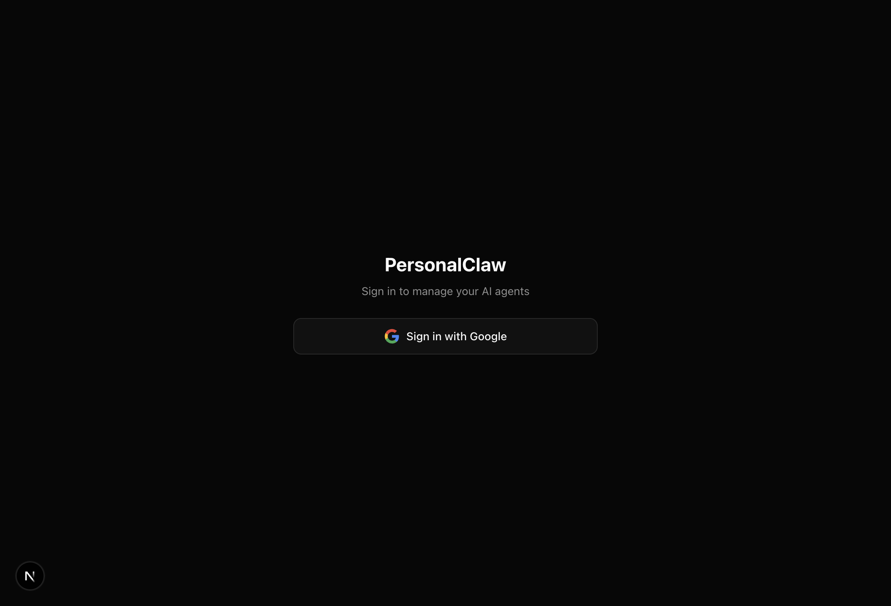

</details>

<details>
<summary><strong>Dashboard Home</strong></summary>

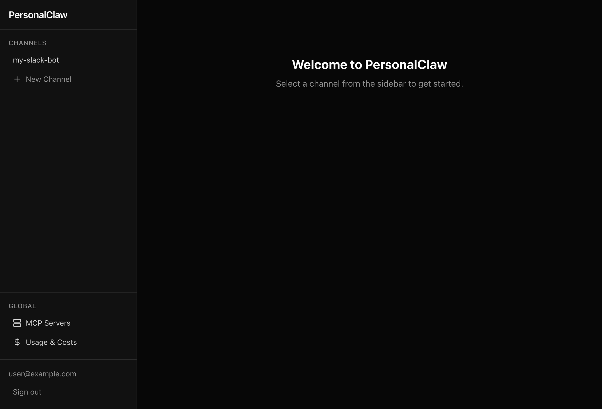

</details>

<details open>
<summary><strong>Channel — Identity & Personality</strong></summary>

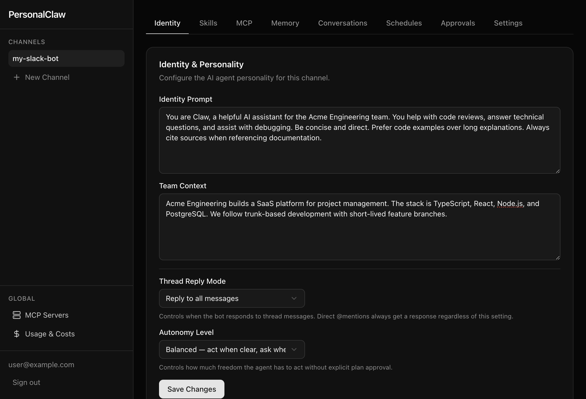

</details>

<details>
<summary><strong>Channel — Skills</strong></summary>

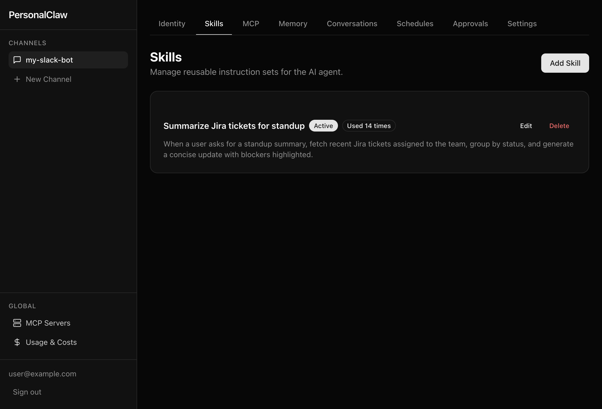

</details>

<details>
<summary><strong>Channel — MCP Servers</strong></summary>

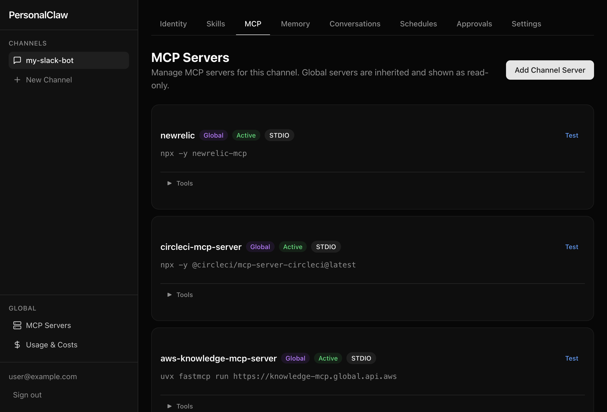

</details>

<details>
<summary><strong>Channel — Memory</strong></summary>

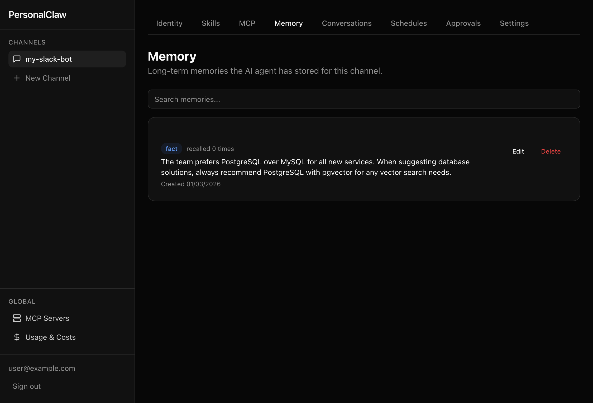

</details>

<details>
<summary><strong>Channel — Conversations</strong></summary>

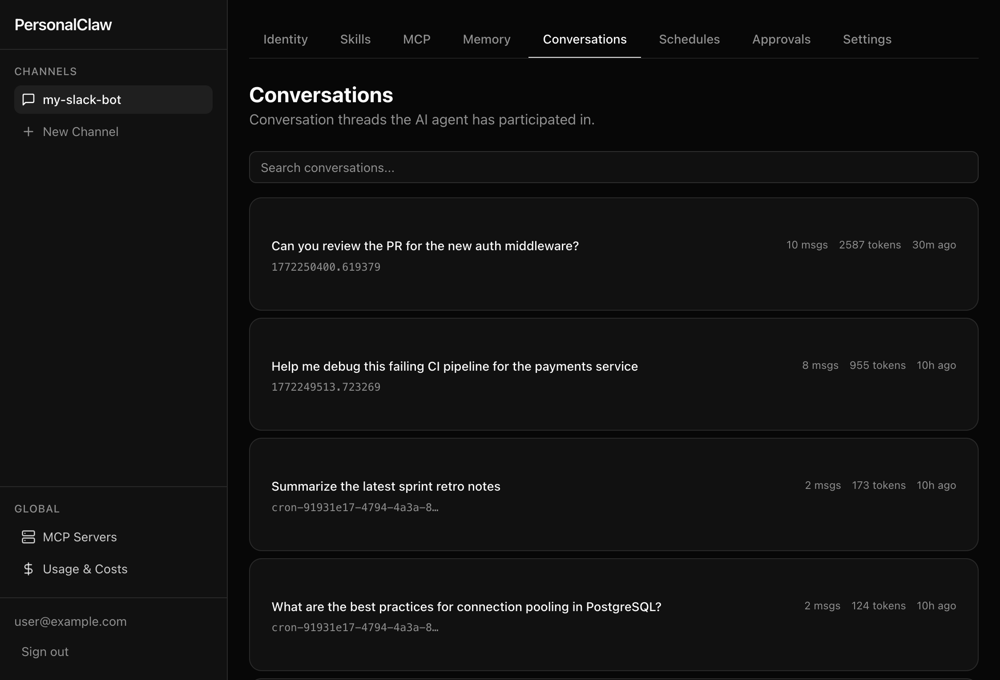

</details>

<details>
<summary><strong>Channel — Schedules</strong></summary>

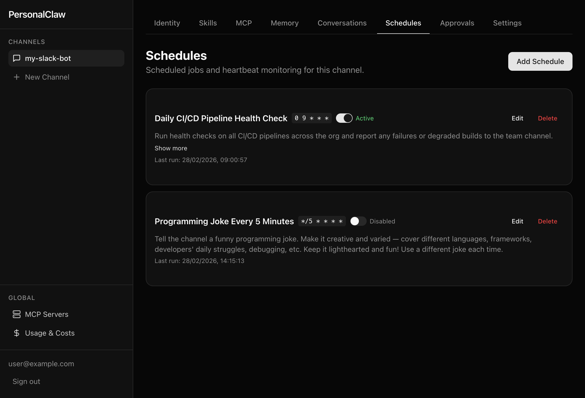

</details>

<details>
<summary><strong>Channel — Approval Policies</strong></summary>

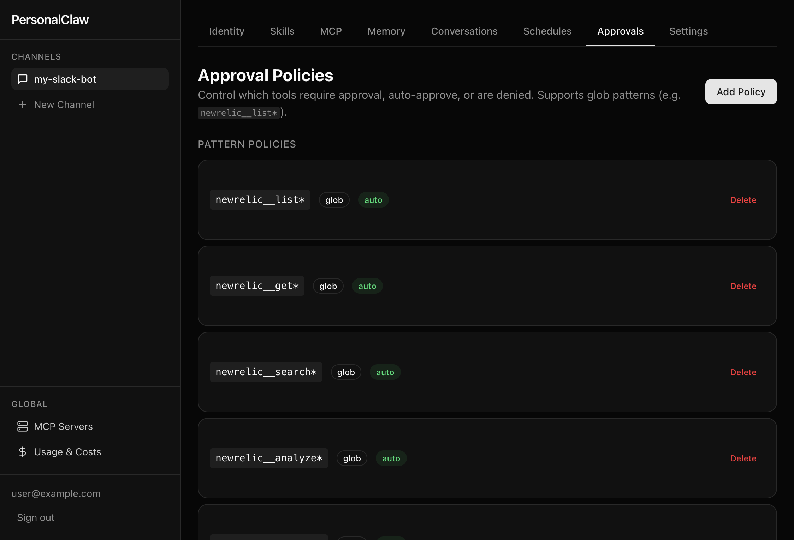

</details>

<details>
<summary><strong>Channel — Settings</strong></summary>

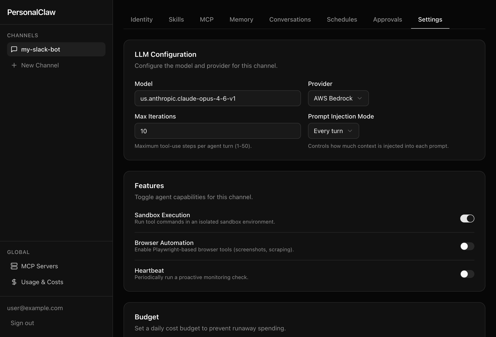

</details>

<details>
<summary><strong>Global MCP Servers</strong></summary>

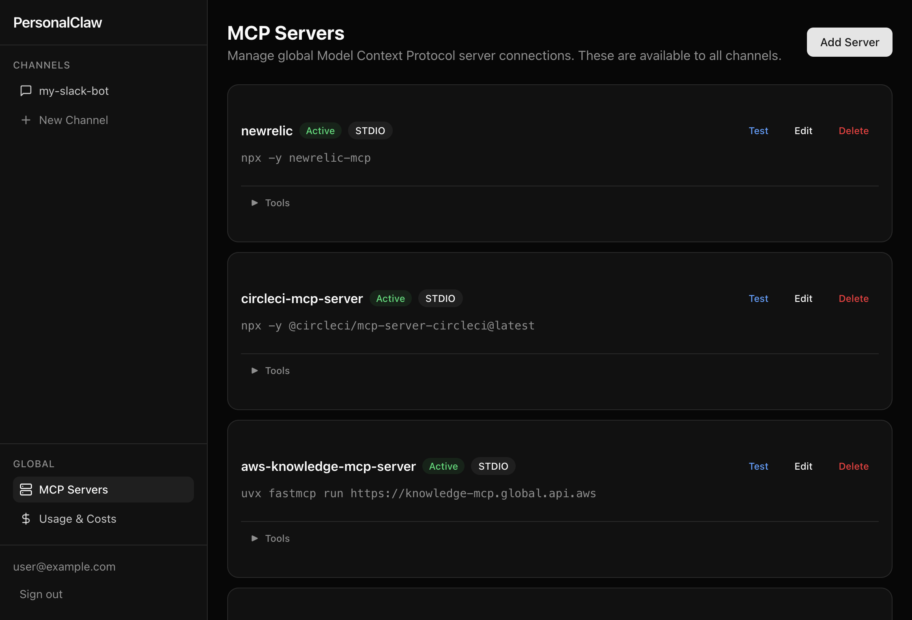

</details>

<details>
<summary><strong>Usage & Costs</strong></summary>

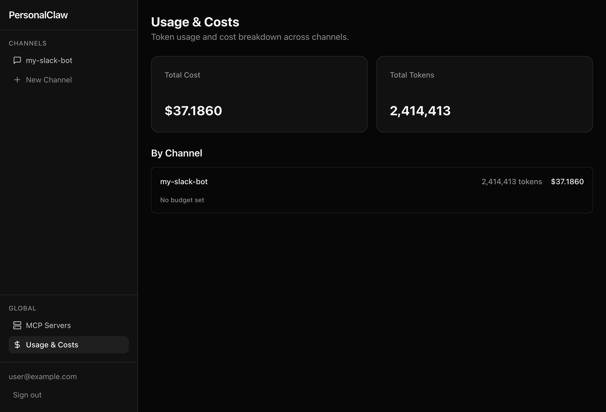

</details>

## Key Design Principles

- **Channel isolation** -- each channel has independent config, memory, and tools
- **Provider agnosticism** -- 4-provider fallback chain (Anthropic, Bedrock, OpenAI, Ollama) via Vercel AI SDK
- **Memory-first** -- 3-tier memory system (Valkey working memory, Postgres conversations, pgvector long-term)
- **Dashboard-driven** -- all configuration via web UI with hot-reload to backend
- **Platform agnosticism** -- `ChannelAdapter` interface decouples agent engine from messaging platforms

For the full tech stack, architecture, and database schema, see [`docs/ARCHITECTURE.md`](docs/ARCHITECTURE.md).

## Prerequisites

- [Bun](https://bun.sh/) >= 1.3
- [Docker](https://www.docker.com/) (for PostgreSQL + Valkey)
- Node.js >= 22

## Quick Start

```bash
# 1. Clone and install
git clone <repo-url> && cd personal-claw
bun install

# 2. Start infrastructure
bun run docker:up

# 3. Configure environment
cp .env.example .env
# Edit .env with your API keys (see docs/ARCHITECTURE.md for full variable reference)

# 4. Run database migrations
bun run db:migrate

# 5. Start development servers
bun run dev
```

The dashboard will be at `http://localhost:3000` and the API at `http://localhost:4000`.

## Commands

| Command               | Description                                      |
| --------------------- | ------------------------------------------------ |
| `bun run dev`         | Start all apps in dev mode (Turborepo)           |
| `bun run build`       | Production build                                 |
| `bun run test`        | Run all tests (Bun test runner)                  |
| `bun run check`       | Lint + format check (Biome)                      |
| `bun run check:fix`   | Auto-fix lint + format issues                    |
| `bun run db:generate` | Generate Drizzle migrations after schema changes |
| `bun run db:migrate`  | Apply pending migrations                         |
| `bun run db:studio`   | Open Drizzle Studio (DB browser)                 |
| `bun run docker:up`   | Start PostgreSQL + Valkey containers             |
| `bun run docker:down` | Stop containers                                  |

## Documentation

| Document                                                   | Description                                         |
| ---------------------------------------------------------- | --------------------------------------------------- |
| [`AGENTS.md`](AGENTS.md)                                   | AI agent coding conventions and architecture rules  |
| [`docs/ARCHITECTURE.md`](docs/ARCHITECTURE.md)             | System architecture, tech stack, schema, data flows |
| [`docs/CHANNELS.md`](docs/CHANNELS.md)                     | Multi-platform channel adapter guide                |
| [`docs/SAFEGUARDS.md`](docs/SAFEGUARDS.md)                 | Human-in-the-loop approval system                   |
| [`docs/SETUP_GOOGLE_OAUTH.md`](docs/SETUP_GOOGLE_OAUTH.md) | Google OAuth setup guide                            |
| [`docs/SETUP_SLACK_BOT.md`](docs/SETUP_SLACK_BOT.md)       | Slack bot setup guide                               |

## License

Private project.
