# PersonalClaw Architecture

> Single source of truth for the PersonalClaw system design. Updated: March 2026.

## Table of Contents

1. [System Overview](#system-overview)
2. [Architecture Diagram](#architecture-diagram)
3. [Tech Stack](#tech-stack)
4. [Database Schema](#database-schema)
5. [Memory Architecture](#memory-architecture)
6. [Agent Engine](#agent-engine)
7. [Channel Integration](#channel-integration)
8. [MCP Integration](#mcp-integration)
9. [Security Model](#security-model)
10. [Data Flows](#data-flows)
11. [API Routes](#api-routes)
12. [Environment Variables](#environment-variables)
13. [Setup Guides](#setup-guides)
14. [Docker Compose](#docker-compose)
15. [CI/CD Pipeline](#cicd-pipeline)

---

## System Overview

PersonalClaw is a per-channel AI agent with a web dashboard for managing agent identity, skills, memory, schedules, and MCP configurations. Each channel gets its own PersonalClaw instance with customizable behavior, while a global MCP config provides shared tool access. The architecture supports multiple messaging platforms (Slack, Discord, Teams, CLI) through a `ChannelAdapter` abstraction.

Key design principles:

- **Channel isolation**: Each channel has independent config, memory, and tools
- **Provider agnosticism**: Vercel AI SDK abstracts LLM providers (Anthropic, Bedrock, OpenAI, Ollama)
- **Memory-first**: 3-tier memory system for context retention across conversations
- **Dashboard-driven**: All configuration via web UI with hot-reload to backend
- **Platform agnosticism**: `ChannelAdapter` interface decouples agent engine from messaging platforms
- **Extensible**: MCP protocol for external tools, hooks for lifecycle events

---

## Architecture Diagram

### System Overview

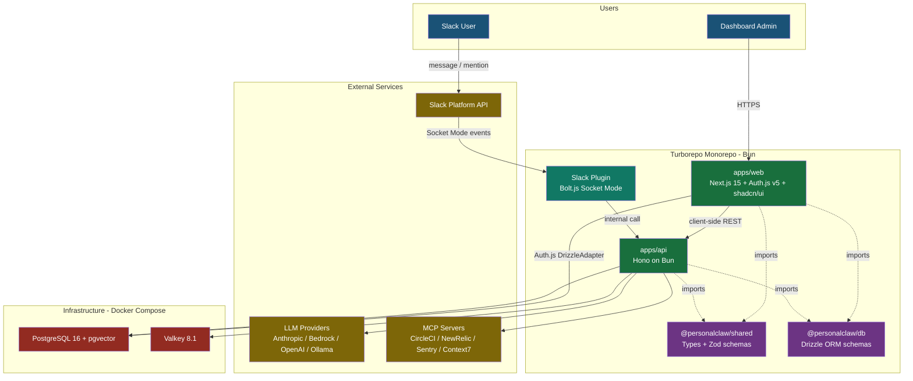

### Dashboard REST Flow

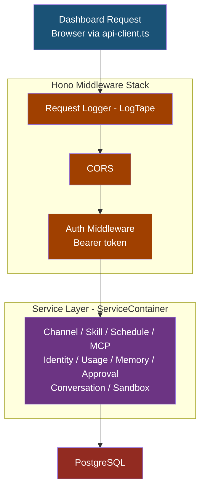

### Slack Message Flow

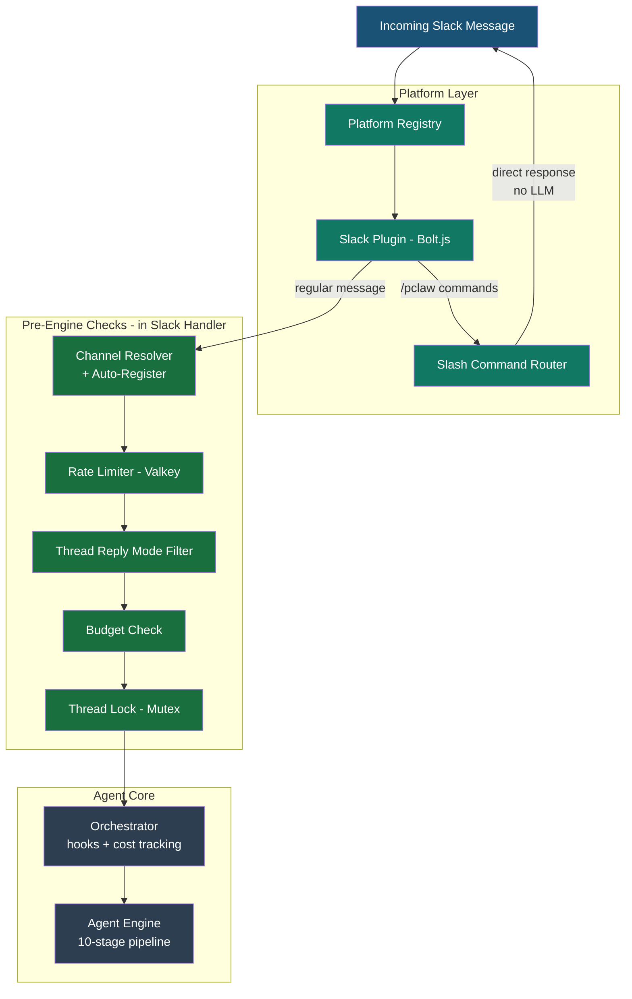

### Agent Pipeline

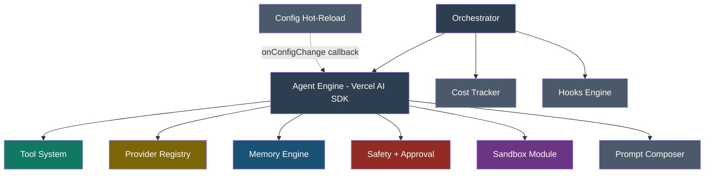

The Engine executes **10 pipeline stages** in sequence, each using specific subsystems:

```mermaid
graph LR
    S1["preProcess<br/>Guardrails"]:::safety
    S2["assembleContext<br/>Memory Engine"]:::mem
    S3["loadTools<br/>Tool Registry + MCP"]:::tool
    S4["createSandbox<br/>Sandbox Manager"]:::sandbox
    S5["wrapApproval<br/>Approval Gateway"]:::safety
    S6["composePrompt<br/>Prompt Composer"]:::support
    S7["generate<br/>Provider Registry"]:::provider
    S8["postProcess<br/>Guardrails"]:::safety
    S9["persist<br/>Memory Engine"]:::mem
    S10["trackSkillUsage<br/>DB"]:::support

    S1 --> S2 --> S3 --> S4 --> S5 --> S6 --> S7 --> S8 --> S9 --> S10

    classDef tool fill:#117864,color:#ffffff
    classDef provider fill:#7d6608,color:#ffffff
    classDef mem fill:#1a5276,color:#ffffff
    classDef safety fill:#922b21,color:#ffffff
    classDef sandbox fill:#6c3483,color:#ffffff
    classDef support fill:#4a5a6b,color:#ffffff
```

### Engine Subsystems

```mermaid
graph TB
    subgraph toolSystem ["Tool System"]
        ToolRegistry["Tool Registry"]:::tool
        ToolProviders["Memory / CLI / Identity<br/>Browser / Schedule / SubAgent"]:::tool
        MCPProvider["MCP Tool Provider"]:::tool
        MCPManager["MCP Manager<br/>client cache + tool policies"]:::tool
    end

    subgraph providerReg ["Provider Registry - Fallback Chain"]
        ProvReg["Dynamic Selection"]:::provider
        AnthropicP["Anthropic"]:::provider
        BedrockP["Bedrock"]:::provider
        OpenAIP["OpenAI"]:::provider
        OllamaP["Ollama"]:::provider
    end

    subgraph memoryEng ["Memory Engine - 3 Tier"]
        WorkingMem["Working - Valkey"]:::mem
        ConvMem["Conversation - Postgres"]:::mem
        LongTermMem["Long-Term - pgvector"]:::mem
    end

    subgraph safetyMod ["Safety and Approval"]
        Guardrails["Guardrails<br/>pre + post processing"]:::safety
        ApprovalGW["Approval Gateway"]:::safety
    end

    subgraph sandboxMod ["Sandbox Module"]
        SandboxMgr["Sandbox Manager"]:::sandbox
        DirectExec["Direct Executor"]:::sandbox
        BubblewrapExec["Bubblewrap"]:::sandbox
        SecurityScan["Security Scanner"]:::sandbox
    end

    PromptComposer["Prompt Composer"]:::support
    SkillsLoader["Skills Loader"]:::support
    SkillGen["Skill Auto-Generator"]:::support

    ToolRegistry --> ToolProviders
    ToolRegistry --> MCPProvider
    MCPProvider --> MCPManager

    ProvReg --> AnthropicP
    ProvReg --> BedrockP
    ProvReg --> OpenAIP
    ProvReg --> OllamaP

    SandboxMgr --> DirectExec
    SandboxMgr --> BubblewrapExec
    SandboxMgr --> SecurityScan

    PromptComposer --> SkillsLoader
    SkillGen -.->|"auto-draft"| SkillsLoader

    classDef tool fill:#117864,color:#ffffff
    classDef provider fill:#7d6608,color:#ffffff
    classDef mem fill:#1a5276,color:#ffffff
    classDef safety fill:#922b21,color:#ffffff
    classDef sandbox fill:#6c3483,color:#ffffff
    classDef support fill:#4a5a6b,color:#ffffff
```

---

## Tech Stack

| Layer        | Technology                                                                          | Version | Purpose                                                                     |
| ------------ | ----------------------------------------------------------------------------------- | ------- | --------------------------------------------------------------------------- |
| **Monorepo** | Turborepo                                                                           | 2.7     | Task orchestration, caching, Bun support via `turbo prune`                  |
| **Runtime**  | Bun                                                                                 | 1.3     | Fast runtime, native TypeScript, built-in test runner                       |
| **Frontend** | Next.js + React                                                                     | 15 + 19 | App Router, Server Components, API routes                                   |
| **UI**       | shadcn/ui                                                                           | latest  | Radix + Tailwind, composable, dark mode, dashboard-ready                    |
| **Auth**     | Auth.js (NextAuth v5)                                                               | beta    | Google OAuth, JWT sessions, Drizzle adapter (split config for Edge Runtime) |
| **Backend**  | Hono                                                                                | 4.x     | Ultralight, Bun-native, middleware-rich, OpenAPI support                    |
| **Slack**    | @slack/bolt                                                                         | 4.x     | Socket Mode, OAuth multi-workspace, event handling                          |
| **AI SDK**   | Vercel AI SDK                                                                       | 6.x     | `generateText`, `streamText`, `createMCPClient`, provider-swap              |
| **LLM**      | @ai-sdk/anthropic + @ai-sdk/amazon-bedrock + @ai-sdk/openai + ollama-ai-provider-v2 | latest  | 4-provider fallback chain: Anthropic, Bedrock, OpenAI, Ollama               |
| **MCP**      | @ai-sdk/mcp                                                                         | latest  | `createMCPClient()` for CircleCI, NewRelic, Sentry, Context7                |
| **ORM**      | Drizzle ORM                                                                         | latest  | TypeScript-first, Bun-compatible, migration tooling                         |
| **Database** | PostgreSQL + pgvector                                                               | 16      | Docker for local, K8s-managed for prod. pgvector for semantic memory search |
| **Cache**    | Valkey                                                                              | 8.1     | Redis-compatible, thread state, config cache, rate limiting                 |
| **Browser**  | Playwright                                                                          | 1.58    | Screenshots, scraping, form filling. Headless Chromium in Docker            |
| **Cron**     | node-cron                                                                           | 3.x     | Scheduled jobs + heartbeat system                                           |
| **Linter**   | Biome                                                                               | 2.4     | Fast linter + formatter, replaces ESLint + Prettier                         |
| **Logging**  | LogTape                                                                             | 2.0     | Structured logging with hierarchical categories, Hono middleware            |
| **IDs**      | nanoid                                                                              | 5.x     | Compact, URL-safe unique ID generation                                      |

---

## Database Schema

> Full schema definitions: `packages/db/src/schema/*.ts`. Migrations: `packages/db/src/migrations/`.

Required extension: `pgvector` (for semantic memory search).

### Tables

| Table | Purpose | Key Columns |
| ----- | ------- | ----------- |
| `channels` | Per-channel agent config | `platform`, `external_id`, `model`, `provider`, `memory_config` (JSONB, default `{"maxMemories": 200, "injectTopN": 10}`), `provider_fallback` (JSONB), `guardrails_config`, `sandbox_config`, `autonomy_level`, `thread_reply_mode`. Unique on `(platform, external_id)` |
| `skills` | Markdown skill definitions per channel | `channel_id` FK, `name`, `content`, `allowed_tools`, `enabled` |
| `skill_usages` | Skill effectiveness tracking | `skill_id` FK, `channel_id` FK, `external_user_id`, `was_helpful` |
| `mcp_configs` | MCP server configs (global + per-channel) | `channel_id` FK (NULL = global), `server_name`, `transport_type` (sse/http/stdio), `server_url`, `command`, `args`, `env` |
| `tool_policies` | Allow/deny lists per MCP server | `channel_id` FK (nullable), `mcp_config_id` FK, `allow_list`, `deny_list` |
| `schedules` | Cron-based scheduled agent jobs | `channel_id` FK, `cron_expression`, `prompt`, `notify_users` |
| `usage_logs` | Token usage and cost per LLM request | `channel_id` FK, `external_user_id`, `provider`, `model`, `prompt_tokens`, `completion_tokens`, `estimated_cost_usd` |
| `approval_policies` | Per-tool approval rules per channel | `channel_id` FK, `tool_name`, `policy` (ask/allowlist/deny/auto), `allowed_users`. Unique on `(channel_id, tool_name)` |
| `workflow_patterns` | Repeated tool sequences for auto-skill generation | `channel_id` FK, `pattern_hash`, `tool_sequence`, `occurrence_count`, `generated_skill_id` FK |
| `conversations` | Tier 2 memory: thread history + compaction | `channel_id` FK, `external_thread_id`, `messages` (JSONB), `summary`, `is_compacted`, `token_count` |
| `channel_memories` | Tier 3 memory: curated facts per channel | `channel_id` FK, `content`, `category`, `embedding` (vector(1024) via raw SQL), `search_vector` (tsvector, generated). HNSW index on embedding, GIN index on search_vector |

Auth.js tables (`users`, `accounts`) also exist via the Drizzle adapter but are managed by Auth.js, not application code.

### Entity Relationship Diagram

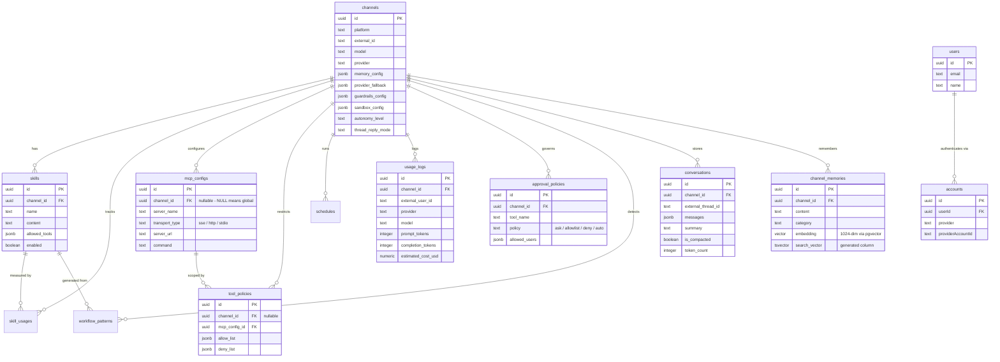

### Key Design Decisions

- UUID primary keys via `crypto.randomUUID()`
- JSONB for dynamic config (guardrails, memory config, provider fallback)
- pgvector for semantic memory search (1024-dim embeddings)
- tsvector for keyword memory search (hybrid with pgvector)
- Drizzle ORM for type-safe queries and migrations
- `embedding` and `search_vector` columns on `channel_memories` are managed via raw SQL migrations (not in Drizzle schema) because Drizzle lacks native pgvector/tsvector column types

---

## Memory Architecture

Adapted from OpenClaw's 3-layer file-based memory, translated to Postgres + pgvector for a database-backed multi-platform agent.

### 3-Tier System

| Tier             | Storage             | Purpose                     | TTL                   |
| ---------------- | ------------------- | --------------------------- | --------------------- |
| 1 - Working      | Valkey              | Current thread context      | 24h                   |
| 2 - Conversation | Postgres            | Thread history + compaction | Permanent             |
| 3 - Long-Term    | Postgres + pgvector | Curated facts per channel   | Permanent (90d decay) |

#### Read Path: Context Assembly

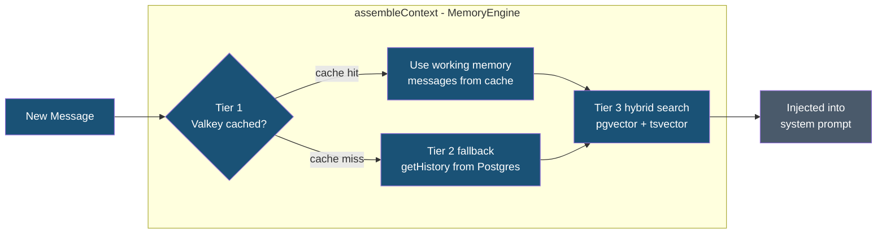

#### Storage Tiers

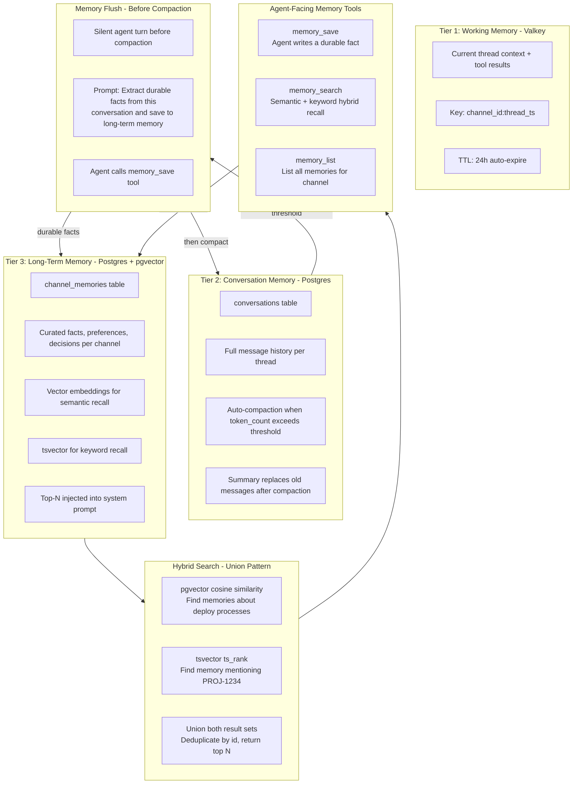

### How It Works at Runtime

1. User messages in a thread. Working memory (Valkey) holds current thread context for fast access.
2. Agent receives thread history from Tier 2 (Postgres conversations) + top-N relevant long-term memories from Tier 3 (injected into system prompt via hybrid search).
3. Agent can call `memory_save` at any time to store a durable fact to Tier 3.
4. Agent can call `memory_search` to recall past knowledge ("What deployment strategy does this team prefer?").
5. When a thread's token count exceeds the compaction threshold, a **memory flush** runs first (silent agent turn to extract important facts), then the thread is compacted to a summary.
6. Memories that haven't been recalled in 90+ days are candidates for cleanup via `memory/decay.ts` (simple decay based on `last_recalled_at`).

### Design Decisions vs OpenClaw

- **No FSRS-6 spaced repetition** -- simple `recall_count` + `last_recalled_at` provides 80% of the benefit without the complexity.
- **No daily log files** -- the `conversations` table with `external_thread_id` already provides chronological history.
- **No separate SQLite index** -- pgvector and tsvector are native to Postgres, eliminating the need for a derived index.
- **Dashboard CRUD for memories** -- the Memory tab in the frontend lets admins view, edit, and delete long-term memories per channel. OpenClaw requires editing `.md` files.

---

## Agent Engine

### Core Loop

1. Pre-process input (guardrails, prompt injection check)
2. Assemble context (conversation history + relevant memories)
3. Compose system prompt (identity + team + skills + memories)
4. Execute `generateText()` with maxSteps (agent loop)
5. Post-process output (guardrails)
6. Persist conversation and update memories
7. Log cost and emit hooks

### Provider Fallback

Ordered provider list per channel. On rate-limit (429), auth error (401/403), or timeout, automatically tries the next provider in the fallback chain.

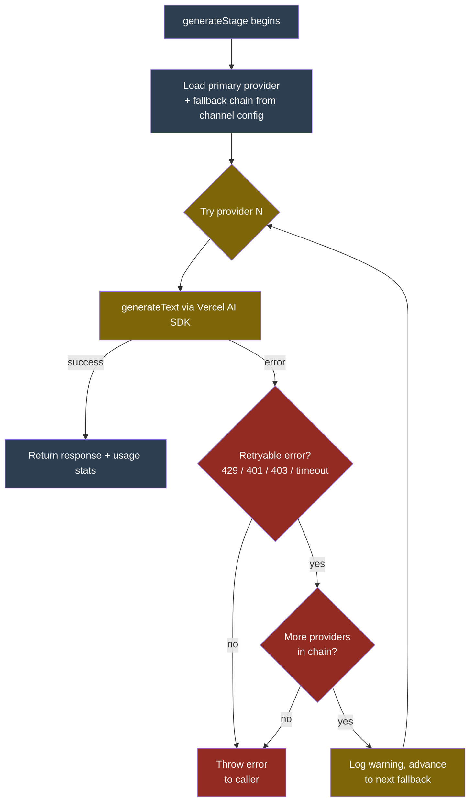

### Prompt Composition Modes

- **every-turn**: Full system prompt every message (most accurate, highest cost)
- **once**: Full prompt on first message, memories-only after (~90% token savings)
- **minimal**: Identity only every turn, team/skills on first message (~70% savings)

---

## Channel Integration

PersonalClaw uses a `ChannelAdapter` interface to decouple the agent engine from messaging platforms. The agent engine, approval gateway, memory engine, and all core logic never import platform-specific SDKs — they depend only on the `ChannelAdapter` abstraction.

See [CHANNELS.md](CHANNELS.md) for the full channel adapter reference, data model, and guide for adding new platforms.

### Currently Supported Platforms

- **Slack** — Socket Mode via Bolt.js, Block Kit for approvals, thread-aware replies

### Adapter Pattern

Each platform implements three methods:

- `sendMessage(threadId, text)` — deliver a response in the correct thread
- `requestApproval(params)` — render approve/deny UI for a single tool call
- `requestPlanApproval(params)` — render approve/reject UI for a multi-step plan

Platform-specific code (bot initialization, event handlers, SDK imports) lives exclusively in `apps/api/src/platforms/<platform>/`.

### Thread Locking

A mutex per `threadId` prevents race conditions when multiple messages arrive for the same thread. The lock is platform-agnostic — any string thread identifier works.

### Human-in-the-Loop Safeguards

PersonalClaw enforces a two-layer approval system before executing any tool:

- **Layer 1 — Plan Confirmation**: The agent must present its intended actions via the `confirm_plan` tool and receive explicit user approval before executing any tools. If a request is ambiguous, the agent asks clarifying questions first.
- **Layer 2 — Per-Tool Approval**: Each tool call passes through the `ApprovalGateway`, which checks the `approval_policies` table for channel-specific overrides (`ask`, `allowlist`, `deny`, `auto`). Tools default to requiring approval unless the user has already approved a plan.

See [SAFEGUARDS.md](SAFEGUARDS.md) for the full safeguard architecture, configuration guide, and developer reference.

---

## MCP Integration

### Configuration

- **Global**: MCP configs with `channel_id = NULL` apply to all channels
- **Per-channel**: Override or add MCP servers for specific channels
- **Tool policies**: Allow/deny lists per channel restrict available tools

### Supported Transports

- Server-Sent Events (SSE)
- HTTP (Streamable HTTP)
- stdio (child process via npx/uvx/node -- connects over stdin/stdout)

---

## Security Model

### Guardrails

- **Pre-processing**: Input validation, content filtering, prompt injection detection
- **Post-processing**: Output validation, PII redaction

### Channel Isolation

All memory and tool operations are scoped to the requesting channel_id. Cross-channel memory access is denied.

### Sandbox Executor

Tools declared as `sandboxed: true` run in a restricted context with timeout and resource limits.

### Human-in-the-Loop Approvals

Two-layer system: plan confirmation (clarification + intent approval) and per-tool approval gateway (configurable via `approval_policies` table). See [SAFEGUARDS.md](SAFEGUARDS.md) for details.

---

## Data Flows

### Slack Handler Flow

Shows the pre-engine checks in `handleMessage()` before the agent runs.

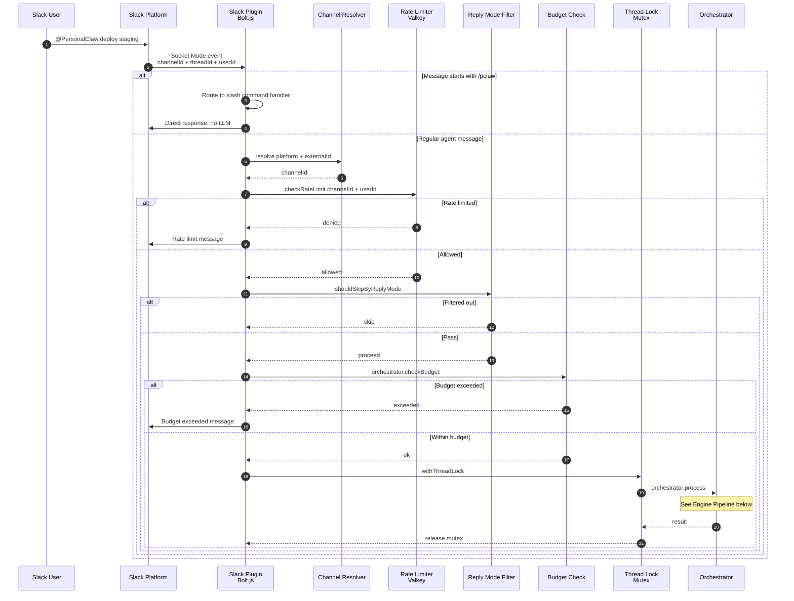

### Engine Pipeline

Shows what happens inside `orchestrator.process()` and the 10-stage agent pipeline.

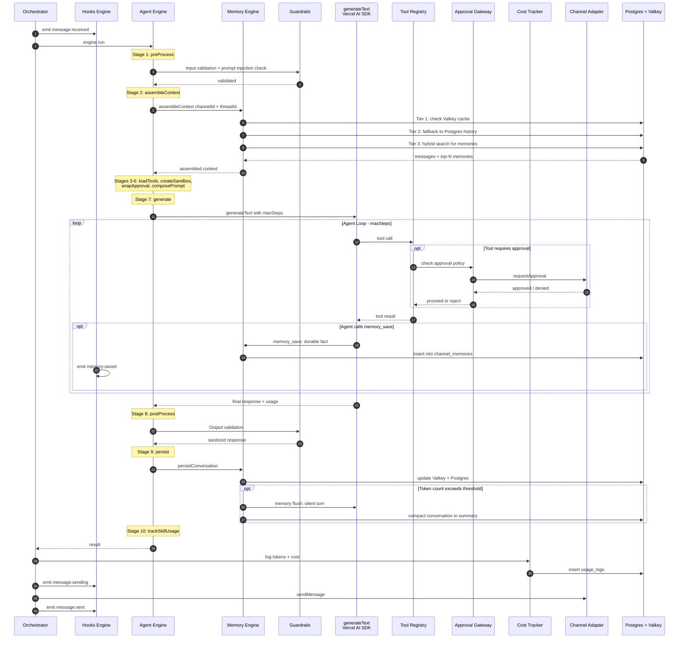

### Config Hot-Reload

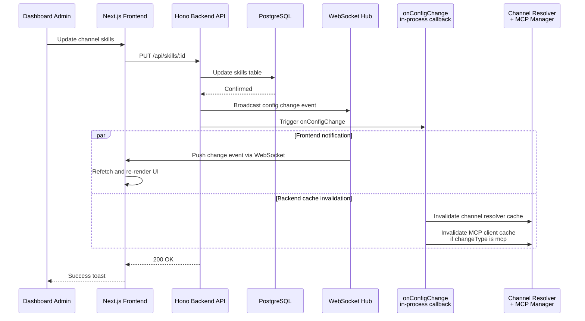

---

## API Routes

> Route definitions: `apps/api/src/routes/*.ts`. All `/api/*` routes require auth middleware.

| Base Path | Module | Purpose |
| --------- | ------ | ------- |
| `/health` | `index.ts` | Health check (no auth) |
| `/api/channels` | `channels.ts` | Channel CRUD |
| `/api/skills` | `skills.ts` | Skill CRUD per channel |
| `/api/skill-stats` | `skill-stats.ts` | Skill usage statistics per channel |
| `/api/mcp` | `mcp.ts` | MCP config CRUD, connection testing, tool listing, tool policies |
| `/api/schedules` | `schedules.ts` | Scheduled job CRUD per channel |
| `/api/identity` | `identity.ts` | Identity + team prompt config per channel |
| `/api/usage` | `usage.ts` | Token usage stats, daily aggregates, budget, model pricing |
| `/api/memories` | `memories.ts` | Long-term memory list, search, edit, delete per channel |
| `/api/conversations` | `conversations.ts` | Conversation history, detail, skill generation from tool calls |
| `/api/approvals` | `approvals.ts` | Approval policy CRUD per channel |

WebSocket: `/ws/config-updates` for config hot-reload (handled in Bun server before Hono).

---

## Environment Variables

| Variable                | Required    | Default                | Description                                               |
| ----------------------- | ----------- | ---------------------- | --------------------------------------------------------- |
| `DATABASE_URL`          | Yes         | -                      | PostgreSQL connection string                              |
| `VALKEY_URL`            | Yes         | -                      | Valkey/Redis connection string                            |
| `SLACK_BOT_TOKEN`       | Conditional | -                      | Slack bot OAuth token (xoxb-) — required if using Slack   |
| `SLACK_APP_TOKEN`       | Conditional | -                      | Slack app-level token (xapp-) — required if using Slack   |
| `SLACK_SIGNING_SECRET`  | Conditional | -                      | Slack signing secret — required if using Slack            |
| `LLM_PROVIDER`          | No          | anthropic              | Default LLM provider                                      |
| `ANTHROPIC_API_KEY`     | Conditional | -                      | Anthropic API key                                         |
| `AWS_ACCESS_KEY_ID`     | Conditional | -                      | AWS credentials for Bedrock                               |
| `AWS_SECRET_ACCESS_KEY` | Conditional | -                      | AWS credentials for Bedrock                               |
| `AWS_REGION`            | Conditional | us-east-1              | AWS region for Bedrock                                    |
| `OPENAI_API_KEY`        | Yes         | -                      | For text-embedding-3-small and OpenAI LLM provider        |
| `EMBEDDING_PROVIDER`    | No          | openai                 | Embedding provider for long-term memory                   |
| `EMBEDDING_MODEL`       | No          | text-embedding-3-small | Embedding model name                                      |
| `AUTH_SECRET`           | Yes         | -                      | NextAuth.js secret                                        |
| `GOOGLE_CLIENT_ID`      | Yes         | -                      | Google OAuth client ID                                    |
| `GOOGLE_CLIENT_SECRET`  | Yes         | -                      | Google OAuth client secret                                |
| `AUTH_URL`              | No          | http://localhost:3000  | Frontend URL                                              |
| `API_URL`               | No          | http://localhost:4000  | Backend API URL                                           |
| `NEXT_PUBLIC_API_URL`   | No          | http://localhost:4000  | Public API URL for frontend                               |
| `GITHUB_TOKEN`          | No          | -                      | GitHub personal access token for gh CLI (read-only scope) |

---

## Setup Guides

Detailed setup instructions are in separate documents:

- [Google OAuth Setup](SETUP_GOOGLE_OAUTH.md) -- Google Cloud Console, OAuth credentials, environment variables
- [Slack Bot Setup](SETUP_SLACK_BOT.md) -- Slack app creation, Socket Mode, bot scopes, event subscriptions

---

## Docker Compose

> See [docker-compose.yaml](../docker-compose.yaml) for the full configuration.

| Service | Image | Port | Purpose |
| ------- | ----- | ---- | ------- |
| `postgres` | `pgvector/pgvector:pg16` | 5432 | PostgreSQL 16 with pgvector extension |
| `valkey` | `valkey/valkey:8.1-alpine` | 6379 | Redis-compatible cache (thread state, config cache, rate limiting) |
| `api` | Built from `apps/api/Dockerfile` | 4000 | Hono backend on Bun |
| `web` | Built from `apps/web/Dockerfile` | 3000 | Next.js frontend dashboard |

The `api` service overrides `DATABASE_URL` and `VALKEY_URL` to use Docker internal hostnames. The `web` service overrides `API_URL` to reach the `api` container. Both read additional env vars from `.env`.

---

## CI/CD Pipeline

> Workflow definitions: `.github/workflows/`. Uses GitHub Actions with reusable workflows.

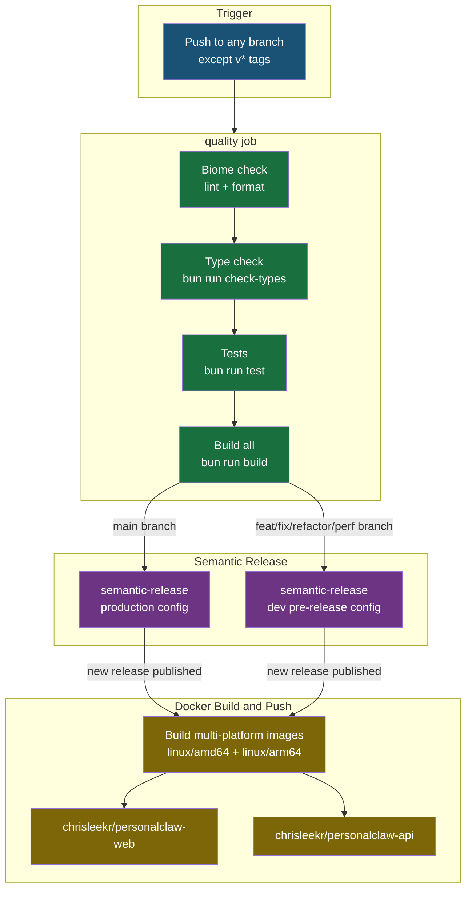

| Workflow | Trigger | Purpose |
| -------- | ------- | ------- |
| `ci.yml` | Push to any branch | Lint, type-check, test, build; triggers semantic release |
| `semantic-release.yml` | Called by CI or manual | Semantic versioning, changelog, GitHub release |
| `docker-build.yml` | Called by semantic-release or manual | Build and push `web` and `api` images to Docker Hub |
| `generate-labels.yml` | PRs and issues | Auto-label from title via `.github/labeler.yml` |
| `merge-dependencies.yml` | Dependabot PRs | Auto-merge minor/patch; comment on major updates |
