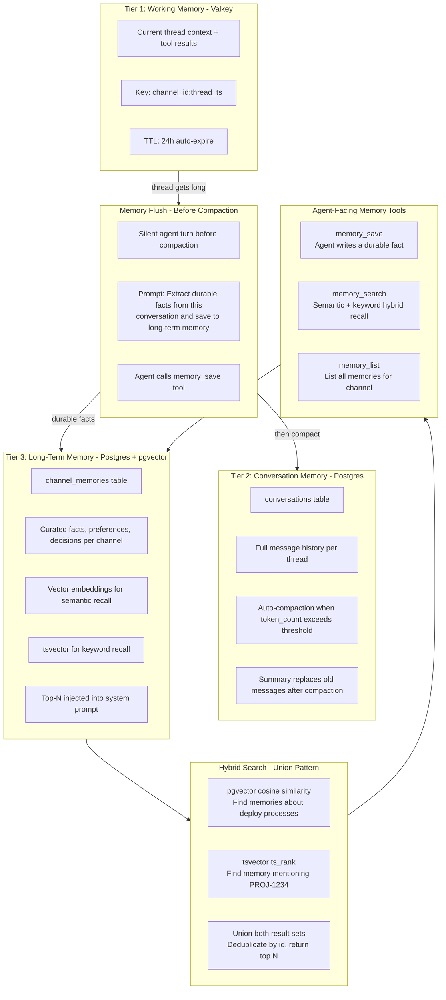
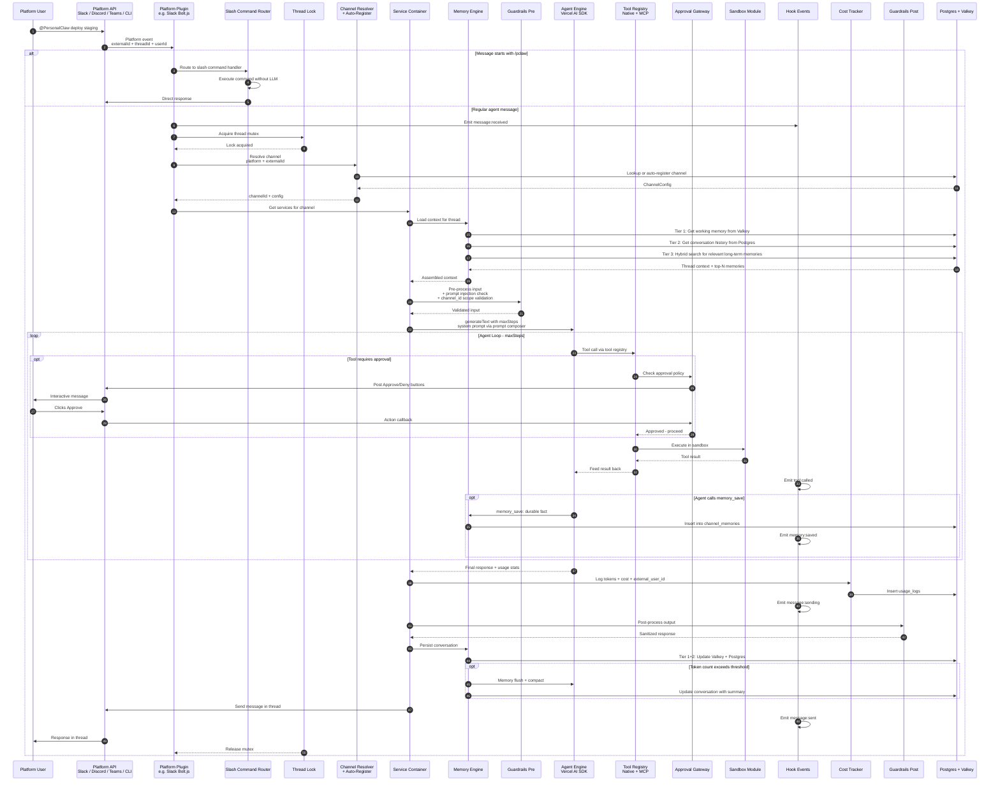
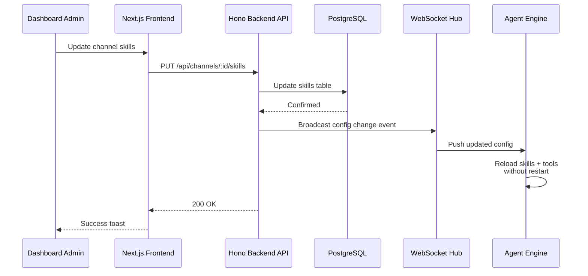

# PersonalClaw Architecture

> Single source of truth for the PersonalClaw system design. Updated: February 2026.

## Table of Contents

1. [System Overview](#system-overview)
2. [Architecture Diagram](#architecture-diagram)
3. [Tech Stack](#tech-stack)
4. [Database Schema](#database-schema)
5. [Memory Architecture](#memory-architecture)
6. [Agent Engine](#agent-engine)
7. [Channel Integration](#channel-integration)
8. [MCP Integration](#mcp-integration)
9. [Security Model](#security-model)
10. [Features & Status](#features--status)
11. [Data Flows](#data-flows)
12. [API Route Inventory](#api-route-inventory)
13. [Environment Variables](#environment-variables)
14. [Setup Guides](#setup-guides)
15. [Docker Compose](#docker-compose)

---

## System Overview

PersonalClaw is a per-channel AI agent with a web dashboard for managing agent identity, skills, memory, schedules, and MCP configurations. Each channel gets its own PersonalClaw instance with customizable behavior, while a global MCP config provides shared tool access. The architecture supports multiple messaging platforms (Slack, Discord, Teams, CLI) through a `ChannelAdapter` abstraction.

Key design principles:

- **Channel isolation**: Each channel has independent config, memory, and tools
- **Provider agnosticism**: Vercel AI SDK abstracts LLM providers (Anthropic, Bedrock, OpenAI, Ollama)
- **Memory-first**: 3-tier memory system for context retention across conversations
- **Dashboard-driven**: All configuration via web UI with hot-reload to backend
- **Platform agnosticism**: `ChannelAdapter` interface decouples agent engine from messaging platforms
- **Extensible**: MCP protocol for external tools, hooks for lifecycle events

---

## Architecture Diagram

```mermaid
graph TB
    subgraph clients ["Clients"]
        SlackBot["Slack Bot<br/>Bolt.js Socket Mode"]
        Dashboard["Next.js Dashboard<br/>shadcn/ui + Google OAuth"]
        Webhooks["External Webhooks<br/>CI/CD, Monitoring Alerts"]
        CLIClient["CLI Client<br/>Direct terminal access"]
    end

    subgraph monorepo ["Turborepo Monorepo - Bun"]
        subgraph frontend ["apps/web - Next.js 15"]
            AuthJS["Auth.js v5<br/>Google OAuth"]
            Pages["Dashboard Pages<br/>Channel Selector / 8 Tabs"]
            CostDash["Cost Dashboard<br/>Token usage per channel"]
            WebAPI["Next.js API Routes<br/>REST proxy to Hono"]
        end

        subgraph backend ["apps/api - Hono on Bun"]
            subgraph platformLayer ["Platform Layer"]
                PlatformReg["Platform Registry<br/>Plugin-based platform support"]
                SlackPlugin["Slack Plugin<br/>Bolt.js + Socket Mode"]
                SlashCmds["Slash Command Router<br/>/pclaw help, status, model, skills"]
            end

            subgraph channelLayer ["Channel Layer"]
                ChannelResolver["Channel Resolver<br/>Platform + externalId lookup"]
                AdapterFactory["Adapter Factory<br/>Platform-specific adapters"]
                ConfigCache["Config Cache<br/>Valkey-backed channel config"]
                AutoRegister["Auto-Register<br/>New channel detection"]
            end

            subgraph middleware ["Middleware"]
                AuthMW["Auth Middleware"]
                RateLimiter["Rate Limiter<br/>Valkey-based throttling"]
                RequestLogger["Request Logger<br/>LogTape structured logging"]
            end

            subgraph services ["Service Layer"]
                ServiceContainer["DI Container<br/>Centralized service access"]
                ChannelSvc["Channel, Memory, Skill,<br/>Approval, Schedule, Usage,<br/>Conversation, MCP, Identity<br/>Services"]
            end

            subgraph agentCore ["Agent Core"]
                Orchestrator["Agent Orchestrator<br/>Pipeline coordination"]
                AgentEngine["Agent Engine<br/>Vercel AI SDK + Provider Fallback"]
                Pipeline["Agent Pipeline<br/>Step-by-step execution"]
                ToolRegistry["Tool Registry<br/>Native + MCP tool merger"]
                ToolProviders["Tool Providers<br/>Memory, CLI, Identity, Browser, Cron tools"]
                SubAgents["Sub-Agent Spawner<br/>Parallel background tasks"]
                PromptComposer["Prompt Composer<br/>inject-once / every-turn / minimal"]
                CostTracker["Cost Tracker<br/>Token usage + spend logging"]
            end

            subgraph providerLayer ["Provider Registry"]
                ProviderReg["Provider Registry<br/>Dynamic provider selection"]
                AnthropicProv["Anthropic Provider"]
                BedrockProv["Bedrock Provider"]
                OpenAIProv["OpenAI Provider"]
                OllamaProv["Ollama Provider"]
            end

            MCPManager["MCP Manager<br/>Global + Per-Channel Config"]
            SkillsLoader["Skills Loader<br/>Hot-Reload Watcher"]
            MemoryEngine["Memory Engine<br/>3-Tier: Valkey / Postgres / pgvector"]
            Guardrails["Guardrails Engine<br/>Pre/Post + Prompt Injection Guard"]
            Approvals["Approval Gateway<br/>Human-in-the-loop via platform buttons"]

            subgraph sandboxMod ["Sandbox Module"]
                SandboxMgr["Sandbox Manager<br/>Execution strategy selection"]
                SandboxDirect["Direct Executor<br/>Subprocess isolation"]
                SandboxSecurity["Security Scanner<br/>Command validation"]
            end

            BrowserAuto["Browser Automation<br/>Playwright: screenshots, scrape, forms"]
            HooksEngine["Hooks / Lifecycle Events<br/>EventEmitter plugin system"]
            CronRunner["Cron Runner<br/>node-cron / Heartbeat"]
            SkillGen["Skill Auto-Generator<br/>Pattern tracking + draft generation"]
            HotReload["Config Hot-Reload<br/>WebSocket Push"]
            CLITools["CLI Tools<br/>Executor, registry, validator"]
            ErrorHandler["Error Handler<br/>Typed AppError + cause chains"]
            PIIMasker["PII Masker<br/>Output sanitization"]
        end

        subgraph packages ["packages/"]
            SharedTypes["@personalclaw/shared<br/>Types, Schemas, Constants"]
            DBPkg["@personalclaw/db<br/>Drizzle ORM + Migrations"]
        end
    end

    subgraph infra ["Infrastructure - Docker Compose"]
        Postgres["PostgreSQL 16 + pgvector<br/>Channel configs, conversations,<br/>skills, schedules, long-term memory,<br/>usage logs, workflow patterns"]
        Valkey["Valkey 8.1<br/>Working memory, thread state,<br/>config cache, rate limiting"]
    end

    subgraph llm ["LLM Providers - Fallback Chain"]
        Anthropic["Anthropic API<br/>@ai-sdk/anthropic"]
        Bedrock["AWS Bedrock<br/>@ai-sdk/amazon-bedrock"]
        OpenAI["OpenAI API<br/>@ai-sdk/openai"]
        Ollama["Ollama<br/>ollama-ai-provider-v2"]
    end

    subgraph mcp ["MCP Servers"]
        CircleCI["CircleCI MCP"]
        NewRelic["NewRelic MCP"]
        Sentry["Sentry MCP"]
        Context7["Context7 MCP"]
        CustomMCP["Custom MCP..."]
    end

    Dashboard --> AuthJS
    Dashboard --> Pages
    Dashboard --> CostDash
    Pages --> WebAPI
    WebAPI --> middleware

    SlackBot --> PlatformReg
    PlatformReg --> SlackPlugin
    SlackPlugin --> SlashCmds
    SlashCmds -->|"LLM bypass"| SlackPlugin
    SlackPlugin --> channelLayer

    channelLayer --> services
    services --> agentCore
    middleware --> services

    Orchestrator --> AgentEngine
    AgentEngine --> SubAgents
    AgentEngine --> ToolRegistry
    ToolRegistry --> MCPManager
    ToolRegistry --> ToolProviders
    AgentEngine --> MemoryEngine
    AgentEngine --> Guardrails
    AgentEngine --> Approvals
    AgentEngine --> sandboxMod
    AgentEngine --> BrowserAuto
    AgentEngine --> CostTracker
    AgentEngine --> PromptComposer
    AgentEngine --> CronRunner
    AgentEngine --> HooksEngine

    AgentEngine --> providerLayer
    MCPManager --> mcp
    SkillGen -.->|"auto-draft"| SkillsLoader

    backend --> Postgres
    backend --> Valkey
    frontend --> Postgres

    HotReload -.->|WebSocket| AgentEngine
    WebAPI -.->|config change| HotReload
```



---

## Tech Stack

| Layer        | Technology                                                                          | Version | Purpose                                                                     |
| ------------ | ----------------------------------------------------------------------------------- | ------- | --------------------------------------------------------------------------- |
| **Monorepo** | Turborepo                                                                           | 2.7     | Task orchestration, caching, Bun support via `turbo prune`                  |
| **Runtime**  | Bun                                                                                 | 1.3     | Fast runtime, native TypeScript, built-in test runner                       |
| **Frontend** | Next.js + React                                                                     | 15 + 19 | App Router, Server Components, API routes                                   |
| **UI**       | shadcn/ui                                                                           | latest  | Radix + Tailwind, composable, dark mode, dashboard-ready                    |
| **Auth**     | Auth.js (NextAuth v5)                                                               | beta    | Google OAuth, JWT sessions, Drizzle adapter (split config for Edge Runtime) |
| **Backend**  | Hono                                                                                | 4.x     | Ultralight, Bun-native, middleware-rich, OpenAPI support                    |
| **Slack**    | @slack/bolt                                                                         | 4.x     | Socket Mode, OAuth multi-workspace, event handling                          |
| **AI SDK**   | Vercel AI SDK                                                                       | 6.x     | `generateText`, `streamText`, `createMCPClient`, provider-swap              |
| **LLM**      | @ai-sdk/anthropic + @ai-sdk/amazon-bedrock + @ai-sdk/openai + ollama-ai-provider-v2 | latest  | 4-provider fallback chain: Anthropic, Bedrock, OpenAI, Ollama               |
| **MCP**      | @ai-sdk/mcp                                                                         | latest  | `createMCPClient()` for CircleCI, NewRelic, Sentry, Context7                |
| **ORM**      | Drizzle ORM                                                                         | latest  | TypeScript-first, Bun-compatible, migration tooling                         |
| **Database** | PostgreSQL + pgvector                                                               | 16      | Docker for local, K8s-managed for prod. pgvector for semantic memory search |
| **Cache**    | Valkey                                                                              | 8.1     | Redis-compatible, thread state, config cache, rate limiting                 |
| **Browser**  | Playwright                                                                          | 1.58    | Screenshots, scraping, form filling. Headless Chromium in Docker            |
| **Cron**     | node-cron                                                                           | 3.x     | Scheduled jobs + heartbeat system                                           |
| **Linter**   | Biome                                                                               | 2.4     | Fast linter + formatter, replaces ESLint + Prettier                         |
| **Logging**  | LogTape                                                                             | 2.0     | Structured logging with hierarchical categories, Hono middleware            |
| **IDs**      | nanoid                                                                              | 5.x     | Compact, URL-safe unique ID generation                                      |

---

## Database Schema

### Required Extensions

```sql
CREATE EXTENSION IF NOT EXISTS vector;
```

### Tables

```sql
-- Platform-agnostic channel configuration
channels (
  id UUID PK,
  platform TEXT NOT NULL DEFAULT 'slack',  -- 'slack' | 'discord' | 'teams' | 'cli'
  external_id TEXT NOT NULL,               -- Platform-specific channel ID
  external_name TEXT,                      -- Human-readable channel name
  identity_prompt TEXT,                    -- IDENTITY.md content
  team_prompt TEXT,                        -- TEAM.md (per-channel context)
  model TEXT DEFAULT 'claude-sonnet-4-20250514',
  provider TEXT DEFAULT 'anthropic',       -- 'anthropic' | 'bedrock' | 'openai' | 'ollama'
  max_iterations INT DEFAULT 10,
  guardrails_config JSONB,                 -- guardrails rules
  sandbox_enabled BOOLEAN DEFAULT true,
  sandbox_config JSONB,                    -- allowed commands, denied patterns, limits
  heartbeat_enabled BOOLEAN DEFAULT false,
  heartbeat_prompt TEXT,
  heartbeat_cron TEXT DEFAULT '*/30 * * * *',
  memory_config JSONB DEFAULT '{"max_memories": 200, "inject_top_n": 10}',
  prompt_inject_mode TEXT DEFAULT 'every-turn',  -- 'every-turn' | 'once' | 'minimal'
  provider_fallback JSONB DEFAULT '[{"provider": "anthropic", "model": "claude-sonnet-4-20250514"}]',
  browser_enabled BOOLEAN DEFAULT false,
  cost_budget_daily_usd DECIMAL(10,2),     -- NULL = unlimited
  thread_reply_mode TEXT DEFAULT 'all',    -- 'all' | 'mentions_only' | 'original_poster'
  autonomy_level TEXT DEFAULT 'balanced',  -- 'cautious' | 'balanced' | 'autonomous'
  created_at TIMESTAMPTZ,
  updated_at TIMESTAMPTZ,
  UNIQUE(platform, external_id)
)

-- Skills per channel
skills (
  id UUID PK,
  channel_id UUID FK -> channels.id ON DELETE CASCADE,
  name TEXT NOT NULL,
  content TEXT NOT NULL,         -- Markdown skill content
  allowed_tools TEXT[] DEFAULT '{}',
  enabled BOOLEAN DEFAULT true,
  created_at TIMESTAMPTZ
)

-- Skill effectiveness tracking
skill_usages (
  id UUID PK,
  skill_id UUID FK -> skills.id ON DELETE CASCADE,
  channel_id UUID FK -> channels.id ON DELETE CASCADE,
  external_user_id TEXT NOT NULL,   -- Who triggered the skill
  was_helpful BOOLEAN,              -- User feedback (nullable until rated)
  created_at TIMESTAMPTZ,
  INDEX(skill_id),
  INDEX(channel_id)
)

-- MCP configurations (global + per-channel, SSE + HTTP + stdio transports)
mcp_configs (
  id UUID PK,
  channel_id UUID NULLABLE FK -> channels.id ON DELETE CASCADE,  -- NULL = global config
  server_name TEXT NOT NULL,
  transport_type TEXT DEFAULT 'sse',  -- 'sse' | 'http' | 'stdio'
  server_url TEXT,                    -- For SSE/HTTP transports (nullable for stdio)
  headers JSONB,                      -- HTTP headers for SSE/HTTP
  command TEXT,                       -- For stdio transport: binary path
  args JSONB,                         -- For stdio transport: command arguments
  env JSONB,                          -- For stdio transport: environment variables
  cwd TEXT,                           -- For stdio transport: working directory
  enabled BOOLEAN DEFAULT true,
  created_at TIMESTAMPTZ,
  UNIQUE(channel_id, server_name)
)

-- Tool policies per channel
tool_policies (
  id UUID PK,
  channel_id UUID NULLABLE FK -> channels.id ON DELETE CASCADE,
  mcp_config_id UUID FK -> mcp_configs.id ON DELETE CASCADE,
  allow_list TEXT[] DEFAULT '{}',
  deny_list TEXT[] DEFAULT '{}',
  created_at TIMESTAMPTZ
)

-- Scheduled jobs
schedules (
  id UUID PK,
  channel_id UUID FK -> channels.id ON DELETE CASCADE,
  name TEXT NOT NULL,
  cron_expression TEXT NOT NULL,
  prompt TEXT NOT NULL,            -- What to ask the agent
  enabled BOOLEAN DEFAULT true,
  notify_users TEXT[] DEFAULT '{}',  -- User IDs to notify on completion
  last_run_at TIMESTAMPTZ,
  created_at TIMESTAMPTZ
)

-- Token usage and cost per LLM request
usage_logs (
  id UUID PK,
  channel_id UUID FK -> channels.id ON DELETE CASCADE,
  external_user_id TEXT NOT NULL,      -- Platform-agnostic user ID
  external_thread_id TEXT,             -- Platform-agnostic thread ID
  provider TEXT NOT NULL,              -- 'anthropic' | 'bedrock' | 'openai' | 'ollama'
  model TEXT NOT NULL,
  prompt_tokens INT NOT NULL,
  completion_tokens INT NOT NULL,
  total_tokens INT NOT NULL,
  estimated_cost_usd DECIMAL(10,6),    -- Calculated from token counts + model pricing
  duration_ms INT,                     -- Request latency
  created_at TIMESTAMPTZ,
  INDEX(channel_id, created_at),
  INDEX(external_user_id, created_at)
)

-- Per-channel tool approval policies
approval_policies (
  id UUID PK,
  channel_id UUID FK -> channels.id ON DELETE CASCADE,
  tool_name TEXT NOT NULL,             -- Tool that requires approval
  policy TEXT DEFAULT 'ask',           -- 'ask' | 'allowlist' | 'deny' | 'auto'
  allowed_users TEXT[] DEFAULT '{}',   -- Platform user IDs who can auto-approve
  created_at TIMESTAMPTZ,
  UNIQUE(channel_id, tool_name)
)

-- Track repeated workflow patterns for auto-skill generation
workflow_patterns (
  id UUID PK,
  channel_id UUID FK -> channels.id ON DELETE CASCADE,
  pattern_hash TEXT NOT NULL,          -- Hash of tool call sequence
  tool_sequence TEXT[] NOT NULL,       -- Ordered list of tools called
  description TEXT,                    -- LLM-generated description of the pattern
  occurrence_count INT DEFAULT 1,
  success_count INT DEFAULT 0,
  last_seen_at TIMESTAMPTZ,
  generated_skill_id UUID NULLABLE FK -> skills.id,  -- NULL until skill is generated
  created_at TIMESTAMPTZ,
  UNIQUE(channel_id, pattern_hash)
)

-- TIER 2: Conversation memory (per thread)
-- Tier 1 (working memory) lives in Valkey, keyed by channel_id:thread_id
conversations (
  id UUID PK,
  channel_id UUID FK -> channels.id ON DELETE CASCADE,
  external_thread_id TEXT NOT NULL,    -- Platform-agnostic thread identifier
  messages JSONB NOT NULL DEFAULT '[]',
  summary TEXT,                        -- Compacted summary (replaces messages when compacted)
  is_compacted BOOLEAN DEFAULT false,
  token_count INT,                     -- Estimated token count for compaction trigger
  created_at TIMESTAMPTZ,
  updated_at TIMESTAMPTZ,
  INDEX(channel_id, external_thread_id)
)

-- TIER 3: Long-term memory (per channel)
-- Durable facts, preferences, decisions the agent extracts from conversations.
channel_memories (
  id UUID PK,
  channel_id UUID FK -> channels.id ON DELETE CASCADE,
  content TEXT NOT NULL,               -- The memory: "Team prefers blue-green deploys"
  category TEXT NOT NULL DEFAULT 'fact',  -- 'fact' | 'preference' | 'decision' | 'person' | 'project' | 'procedure'
  source_thread_id TEXT,               -- Thread this memory was extracted from
  -- pgvector + tsvector columns managed via raw SQL migration:
  -- embedding vector(1024)            -- pgvector: for semantic similarity search
  -- search_vector tsvector            -- Postgres FTS: for keyword search
  --   GENERATED ALWAYS AS (to_tsvector('english', content)) STORED
  recall_count INT DEFAULT 0,          -- How often this memory has been retrieved
  last_recalled_at TIMESTAMPTZ,        -- For simple decay: stale if not recalled in 90 days
  created_at TIMESTAMPTZ,
  updated_at TIMESTAMPTZ,
  INDEX(channel_id),
  INDEX USING ivfflat (embedding vector_cosine_ops) WITH (lists = 100),
  INDEX USING gin (search_vector)
)
```

### Key Design Decisions

- UUID primary keys via `crypto.randomUUID()`
- JSONB for dynamic config (guardrails, memory config, provider fallback)
- pgvector for semantic memory search (1024-dim embeddings)
- tsvector for keyword memory search (hybrid with pgvector)
- Drizzle ORM for type-safe queries and migrations

---

## Memory Architecture

Adapted from OpenClaw's 3-layer file-based memory, translated to Postgres + pgvector for a database-backed multi-platform agent.

### 3-Tier System

| Tier             | Storage             | Purpose                     | TTL                   |
| ---------------- | ------------------- | --------------------------- | --------------------- |
| 1 - Working      | Valkey              | Current thread context      | 24h                   |
| 2 - Conversation | Postgres            | Thread history + compaction | Permanent             |
| 3 - Long-Term    | Postgres + pgvector | Curated facts per channel   | Permanent (90d decay) |



### How It Works at Runtime

1. User messages in a thread. Working memory (Valkey) holds current thread context for fast access.
2. Agent receives thread history from Tier 2 (Postgres conversations) + top-N relevant long-term memories from Tier 3 (injected into system prompt via hybrid search).
3. Agent can call `memory_save` at any time to store a durable fact to Tier 3.
4. Agent can call `memory_search` to recall past knowledge ("What deployment strategy does this team prefer?").
5. When a thread's token count exceeds the compaction threshold, a **memory flush** runs first (silent agent turn to extract important facts), then the thread is compacted to a summary.
6. Memories that haven't been recalled in 90+ days are candidates for cleanup via `memory/decay.ts` (simple decay based on `last_recalled_at`).

### Design Decisions vs OpenClaw

- **No FSRS-6 spaced repetition** -- simple `recall_count` + `last_recalled_at` provides 80% of the benefit without the complexity.
- **No daily log files** -- the `conversations` table with `external_thread_id` already provides chronological history.
- **No separate SQLite index** -- pgvector and tsvector are native to Postgres, eliminating the need for a derived index.
- **Dashboard CRUD for memories** -- the Memory tab in the frontend lets admins view, edit, and delete long-term memories per channel. OpenClaw requires editing `.md` files.

---

## Agent Engine

### Core Loop

1. Pre-process input (guardrails, prompt injection check)
2. Assemble context (conversation history + relevant memories)
3. Compose system prompt (identity + team + skills + memories)
4. Execute `generateText()` with maxSteps (agent loop)
5. Post-process output (guardrails)
6. Persist conversation and update memories
7. Log cost and emit hooks

### Provider Fallback

Ordered provider list per channel. On rate-limit (429) or timeout, automatically tries next provider.

### Prompt Composition Modes

- **every-turn**: Full system prompt every message (most accurate, highest cost)
- **once**: Full prompt on first message, memories-only after (~90% token savings)
- **minimal**: Identity only every turn, team/skills on first message (~70% savings)

---

## Channel Integration

PersonalClaw uses a `ChannelAdapter` interface to decouple the agent engine from messaging platforms. The agent engine, approval gateway, memory engine, and all core logic never import platform-specific SDKs — they depend only on the `ChannelAdapter` abstraction.

See [CHANNELS.md](CHANNELS.md) for the full channel adapter reference, data model, and guide for adding new platforms.

### Currently Supported Platforms

- **Slack** — Socket Mode via Bolt.js, Block Kit for approvals, thread-aware replies

### Adapter Pattern

Each platform implements three methods:

- `sendMessage(threadId, text)` — deliver a response in the correct thread
- `requestApproval(params)` — render approve/deny UI for a single tool call
- `requestPlanApproval(params)` — render approve/reject UI for a multi-step plan

Platform-specific code (bot initialization, event handlers, SDK imports) lives exclusively in `apps/api/src/platforms/<platform>/`.

### Thread Locking

A mutex per `threadId` prevents race conditions when multiple messages arrive for the same thread. The lock is platform-agnostic — any string thread identifier works.

### Human-in-the-Loop Safeguards

PersonalClaw enforces a two-layer approval system before executing any tool:

- **Layer 1 — Plan Confirmation**: The agent must present its intended actions via the `confirm_plan` tool and receive explicit user approval before executing any tools. If a request is ambiguous, the agent asks clarifying questions first.
- **Layer 2 — Per-Tool Approval**: Each tool call passes through the `ApprovalGateway`, which checks the `approval_policies` table for channel-specific overrides (`ask`, `allowlist`, `deny`, `auto`). Tools default to requiring approval unless the user has already approved a plan.

See [SAFEGUARDS.md](SAFEGUARDS.md) for the full safeguard architecture, configuration guide, and developer reference.

---

## MCP Integration

### Configuration

- **Global**: MCP configs with `channel_id = NULL` apply to all channels
- **Per-channel**: Override or add MCP servers for specific channels
- **Tool policies**: Allow/deny lists per channel restrict available tools

### Supported Transports

- Server-Sent Events (SSE)
- HTTP (Streamable HTTP)
- stdio (child process via npx/uvx/node -- connects over stdin/stdout)

---

## Security Model

### Guardrails

- **Pre-processing**: Input validation, content filtering, prompt injection detection
- **Post-processing**: Output validation, PII redaction

### Channel Isolation

All memory and tool operations are scoped to the requesting channel_id. Cross-channel memory access is denied.

### Sandbox Executor

Tools declared as `sandboxed: true` run in a restricted context with timeout and resource limits.

### Human-in-the-Loop Approvals

Two-layer system: plan confirmation (clarification + intent approval) and per-tool approval gateway (configurable via `approval_policies` table). See [SAFEGUARDS.md](SAFEGUARDS.md) for details.

---

## Features & Status

### MVP Core

- **Monorepo scaffold**: Turborepo + Bun, `apps/web`, `apps/api`, `packages/shared`, `packages/db`
- **Docker Compose**: PostgreSQL 16 (with pgvector extension), Valkey 8.1 (api/web run natively via Bun)
- **Backend (Hono)**: Basic routes, health check, Drizzle connection, LogTape structured logging
- **Platform abstraction**: `ChannelAdapter` interface, platform registry, Slack plugin (Bolt.js Socket Mode)
- **User attribution**: Store `external_user_id` on every conversation turn and usage log
- **Agent Engine**: Vercel AI SDK `generateText` with configurable provider via provider registry
- **Cost tracking**: Log `promptTokens` + `completionTokens` from AI SDK response to `usage_logs` table per request
- **MCP Manager**: `createMCPClient()` for global MCP servers (SSE, HTTP, and stdio transports)
- **Memory Tier 1+2**: Valkey working memory for active threads + Postgres conversation history per thread
- **Frontend (Next.js)**: Auth.js Google OAuth login, basic channel list page
- **Error handling**: Typed `AppError` with cause chains, global error handler middleware

### Dashboard + Multi-Channel + Long-Term Memory

- **Channel management CRUD**: Create/edit/delete channel configs via dashboard
- **Dashboard UI**: Left sidebar channel selector, right side tabs (Identity, Skills, Memory, Schedules, Conversations, Settings, Approvals, MCP)
- **Global pages**: Usage dashboard (cross-channel cost view), Global MCP config page
- **Channel resolver**: Platform + `externalId` lookup, auto-register new channels on first message
- **Config cache**: Valkey-backed channel config cache for fast lookups
- **Slash commands**: `/pclaw help`, `/pclaw status`, `/pclaw model <name>`, `/pclaw skills`, `/pclaw memory`, `/pclaw compact`, `/pclaw config`. Intercept in Bolt.js before LLM -- zero token cost
- **Human-in-the-loop approvals**: Approval gateway checks tool policies. Post platform interactive buttons (Approve/Deny). Block execution until user responds. Approval policies configurable per channel in dashboard. Supports `ask`, `allowlist`, `deny`, and `auto` policies
- **Cost dashboard**: Per-channel token usage charts, daily/weekly spend, budget alerts when `cost_budget_daily_usd` threshold is approached
- **Prompt injection protection**: Validate all memory/tool operations are scoped to requesting `channel_id`. Deny cross-channel memory access. Sanitize user input for injection patterns
- **Memory Tier 3**: Long-term memory with pgvector embeddings + tsvector keyword search. Agent tools: `memory_save`, `memory_search`, `memory_list`
- **Memory flush + compaction**: Silent agent turn to extract durable facts before compacting long threads
- **Memory tab in dashboard**: View, search, edit, delete long-term memories per channel
- **Per-channel MCP toggles**: Enable/disable MCP servers per channel from dashboard
- **Global MCP config**: MCP configs with `channel_id = NULL` apply to all channels
- **Skills CRUD**: Create/edit/delete skills per channel via dashboard
- **Hot-reload**: WebSocket connection from backend to push config changes instantly when dashboard updates are saved
- **Thread lock**: Mutex per `thread_id` to prevent race conditions on concurrent messages
- **Service layer**: DI container with 9 service modules (channel, memory, skill, approval, schedule, usage, conversation, MCP, identity)

### Production Hardening

- **Guardrails engine**: Pre-processing (input validation, content filtering, intent classification) and post-processing (output validation, PII redaction, response format enforcement)
- **Sandbox module**: Full sandbox with manager, direct subprocess executor, bubblewrap container isolation, security scanner, and configurable `SandboxConfig` per channel (allowed commands, denied patterns, timeouts, workspace size limits, network access)
- **Provider fallback chain**: Ordered provider list per channel (`provider_fallback` JSONB). Provider registry with 4 providers (Anthropic, Bedrock, OpenAI, Ollama). On rate-limit (429) or timeout, automatically try next provider
- **Hooks / lifecycle events**: EventEmitter-based system: `message:received`, `message:sending` (can modify/cancel), `message:sent`, `tool:called`, `memory:saved`, `identity:updated`, `budget:warning`, `budget:exceeded`, `reaction:received`. Hook scripts auto-discovered from `hooks/builtin/`. Built-in hooks for cost logging and audit trail
- **Sub-agent delegation**: `spawn_subtask` agent tool. Spawns parallel `generateText` calls with isolated context, filtered tools, configurable model, and timeout. Results stored in Valkey keyed by task ID. Main agent retrieves via `get_subtask_result`. Enables parallel investigation workflows
- **Prompt composition modes**: Configurable `prompt_inject_mode` per channel: `every-turn` (inject identity + team + skills every turn), `once` (first message only, ~90% token savings), `minimal` (only identity every turn, ~70% savings)
- **Image processing**: Download platform file uploads, pass image buffers to vision models via Vercel AI SDK multimodal `content` array. Support screenshots, error screenshots, architecture diagrams
- **Heartbeat system**: Periodic agent wake via `node-cron` to proactively check monitoring tools (NewRelic, Sentry, CircleCI) and report only actionable issues
- **Memory decay**: Cleanup memories not recalled in 90+ days via `memory/decay.ts`. Configurable per channel via `memory_config`
- **Cron scheduler**: User-defined scheduled jobs per channel (e.g., "morning briefing at 9am") with `notify_users` support
- **Tool policies**: Allow/deny lists per channel to restrict which MCP tools are available
- **JSONL transcript logging**: Structured conversation logs with user attribution for audit and replay
- **Rate limiting**: Valkey-based rate limiter middleware
- **PII masking**: Output sanitization utility for post-processing
- **CLI tools**: CLI executor, command registry, validator for sandboxed command execution
- **Middleware layer**: Auth, rate-limiter, and request-logger middleware
- **Thread reply modes**: Configurable `thread_reply_mode` per channel: `all`, `mentions_only`, `original_poster`
- **Autonomy levels**: Configurable `autonomy_level` per channel: `cautious`, `balanced`, `autonomous`

### Advanced Agent Capabilities

- **Browser automation**: Playwright integration running headless Chromium in Docker. Agent tools: `browser_screenshot` (capture URL as image, post to channel), `browser_scrape` (extract structured data from web pages), `browser_fill` (fill forms in internal tools). Browser pool manager with concurrent page limits and timeout
- **Self-improving skills**: Track tool call sequences in `workflow_patterns` table. Hash the sequence for dedup. When `occurrence_count >= 5` and `success_count / occurrence_count >= 0.7`, trigger skill auto-generation: run a `generateText` call that drafts a SKILL.md combining those tool calls into a single skill. Save as draft skill (`enabled: false`) for admin review in dashboard
- **Skill effectiveness tracking**: `skill_usages` table logs which skills are used, with `was_helpful` feedback. Stats API surfaces usage counts. Low-performing skills surfaced in dashboard for review or deletion
- **Multi-platform types**: `ChannelPlatform` type supports `slack`, `discord`, `teams`, `cli`. Platform registry allows plugging in new adapters. Currently only Slack adapter is implemented

### Status

| Category           | Feature                         | Status      |
| ------------------ | ------------------------------- | ----------- |
| **Infrastructure** | Backend framework (Hono)        | Done        |
| **Infrastructure** | ORM (Drizzle)                   | Done        |
| **Infrastructure** | Docker Compose + pgvector       | Done        |
| **Infrastructure** | Biome linter + formatter        | Done        |
| **Infrastructure** | LogTape structured logging      | Done        |
| **Infrastructure** | Error handling module           | Done        |
| **Infrastructure** | Service layer / DI container    | Done        |
| **Infrastructure** | Platform abstraction            | Done        |
| **Core Agent**     | Thread lock / Lane Queue        | Done        |
| **Core Agent**     | Heartbeat system                | Done        |
| **Core Agent**     | 3-tier memory system            | Done        |
| **Core Agent**     | Memory decay cleanup            | Done        |
| **Core Agent**     | Prompt composition modes        | Done        |
| **Core Agent**     | Provider fallback chain         | Done        |
| **Core Agent**     | Provider registry (4 providers) | Done        |
| **Core Agent**     | Sub-agent delegation            | Done        |
| **Core Agent**     | Agent orchestrator + pipeline   | Done        |
| **Platform UX**    | Slash commands                  | Done        |
| **Platform UX**    | Human-in-the-loop approvals     | Done        |
| **Platform UX**    | Image processing                | Done        |
| **Platform UX**    | Thread reply modes              | Done        |
| **Platform UX**    | Reaction-based feedback         | Done        |
| **Security**       | Guardrails pre/post             | Done        |
| **Security**       | Prompt injection protection     | Done        |
| **Security**       | Tool policies (allow/deny)      | Done        |
| **Security**       | Sandbox module (full)           | Done        |
| **Security**       | PII masking                     | Done        |
| **Observability**  | Cost tracking + budget alerts   | Done        |
| **Observability**  | User attribution                | Done        |
| **Observability**  | JSONL transcript logging        | Done        |
| **Extensibility**  | Hooks / lifecycle events        | Done        |
| **Extensibility**  | Self-improving skills           | Done        |
| **Extensibility**  | Skill effectiveness tracking    | Done        |
| **Extensibility**  | Browser automation (Playwright) | Done        |
| **Extensibility**  | CLI tools                       | Done        |
| **Config**         | Hot-reload via WebSocket        | Done        |
| **Config**         | Rate limiting                   | Done        |
| **Config**         | Autonomy levels                 | Done        |
| **Multi-platform** | Platform type system            | Partial     |
| **Multi-platform** | Slack adapter                   | Done        |
| **Multi-platform** | Discord / Teams / CLI adapters  | Not started |

---

## Data Flows

### Message Processing



### Config Hot-Reload



---

## API Route Inventory

| Method | Path                            | Description                  |
| ------ | ------------------------------- | ---------------------------- |
| GET    | `/health`                       | Health check                 |
| GET    | `/api/channels`                 | List all channels            |
| GET    | `/api/channels/:id`             | Get channel by ID            |
| POST   | `/api/channels`                 | Create channel               |
| PUT    | `/api/channels/:id`             | Update channel               |
| DELETE | `/api/channels/:id`             | Delete channel               |
| GET    | `/api/skills/:channelId`        | List skills for channel      |
| POST   | `/api/skills`                   | Create skill                 |
| PUT    | `/api/skills/:id`               | Update skill                 |
| DELETE | `/api/skills/:id`               | Delete skill                 |
| GET    | `/api/mcp`                      | List all MCP configs         |
| GET    | `/api/mcp/:channelId`           | List MCP configs for channel |
| POST   | `/api/mcp`                      | Create MCP config            |
| PUT    | `/api/mcp/:id`                  | Update MCP config            |
| DELETE | `/api/mcp/:id`                  | Delete MCP config            |
| GET    | `/api/schedules/:channelId`     | List schedules               |
| POST   | `/api/schedules`                | Create schedule              |
| PUT    | `/api/schedules/:id`            | Update schedule              |
| DELETE | `/api/schedules/:id`            | Delete schedule              |
| GET    | `/api/identity/:channelId`      | Get identity config          |
| PUT    | `/api/identity/:channelId`      | Update identity config       |
| GET    | `/api/usage/:channelId`         | Get usage stats              |
| GET    | `/api/usage/:channelId/daily`   | Get daily usage              |
| GET    | `/api/approvals/:channelId`     | List approval policies       |
| POST   | `/api/approvals`                | Create approval policy       |
| DELETE | `/api/approvals/:id`            | Delete approval policy       |
| GET    | `/api/memories/:channelId`      | List long-term memories      |
| GET    | `/api/conversations/:channelId` | List conversations           |
| GET    | `/api/skill-stats/:channelId`   | Skill usage statistics       |

---

## Environment Variables

| Variable                | Required    | Default                | Description                                               |
| ----------------------- | ----------- | ---------------------- | --------------------------------------------------------- |
| `DATABASE_URL`          | Yes         | -                      | PostgreSQL connection string                              |
| `VALKEY_URL`            | Yes         | -                      | Valkey/Redis connection string                            |
| `SLACK_BOT_TOKEN`       | Conditional | -                      | Slack bot OAuth token (xoxb-) — required if using Slack   |
| `SLACK_APP_TOKEN`       | Conditional | -                      | Slack app-level token (xapp-) — required if using Slack   |
| `SLACK_SIGNING_SECRET`  | Conditional | -                      | Slack signing secret — required if using Slack            |
| `LLM_PROVIDER`          | No          | anthropic              | Default LLM provider                                      |
| `ANTHROPIC_API_KEY`     | Conditional | -                      | Anthropic API key                                         |
| `AWS_ACCESS_KEY_ID`     | Conditional | -                      | AWS credentials for Bedrock                               |
| `AWS_SECRET_ACCESS_KEY` | Conditional | -                      | AWS credentials for Bedrock                               |
| `AWS_REGION`            | Conditional | us-east-1              | AWS region for Bedrock                                    |
| `OPENAI_API_KEY`        | Yes         | -                      | For text-embedding-3-small and OpenAI LLM provider        |
| `EMBEDDING_PROVIDER`    | No          | openai                 | Embedding provider for long-term memory                   |
| `EMBEDDING_MODEL`       | No          | text-embedding-3-small | Embedding model name                                      |
| `AUTH_SECRET`           | Yes         | -                      | NextAuth.js secret                                        |
| `GOOGLE_CLIENT_ID`      | Yes         | -                      | Google OAuth client ID                                    |
| `GOOGLE_CLIENT_SECRET`  | Yes         | -                      | Google OAuth client secret                                |
| `AUTH_URL`              | No          | http://localhost:3000  | Frontend URL                                              |
| `API_URL`               | No          | http://localhost:4000  | Backend API URL                                           |
| `NEXT_PUBLIC_API_URL`   | No          | http://localhost:4000  | Public API URL for frontend                               |
| `GITHUB_TOKEN`          | No          | -                      | GitHub personal access token for gh CLI (read-only scope) |

---

## Setup Guides

Detailed setup instructions are in separate documents:

- [Google OAuth Setup](SETUP_GOOGLE_OAUTH.md) -- Google Cloud Console, OAuth credentials, environment variables
- [Slack Bot Setup](SETUP_SLACK_BOT.md) -- Slack app creation, Socket Mode, bot scopes, event subscriptions

---

## Docker Compose

```yaml
services:
  postgres:
    container_name: postgres
    image: pgvector/pgvector:pg16 # Postgres 16 with pgvector extension pre-installed
    restart: unless-stopped
    environment:
      POSTGRES_DB: personalclaw
      POSTGRES_USER: claw
      POSTGRES_PASSWORD: claw_dev
    ports:
      - "5432:5432"
    volumes:
      - pg_data:/var/lib/postgresql/data
    healthcheck:
      test: ["CMD-SHELL", "pg_isready -U claw -d personalclaw"]
      interval: 5s
      timeout: 5s
      retries: 5

  valkey:
    container_name: valkey
    image: valkey/valkey:8.1-alpine
    restart: unless-stopped
    ports:
      - "6379:6379"
    healthcheck:
      test: ["CMD", "valkey-cli", "ping"]
      interval: 5s
      timeout: 5s
      retries: 5

  # api and web run natively via Bun in local dev.
  # Uncomment for containerized deployment.
  # api:
  #   build:
  #     context: .
  #     dockerfile: apps/api/Dockerfile
  #   restart: unless-stopped
  #   ports:
  #     - "4000:4000"
  #   env_file: .env
  #   volumes:
  #     - ${HOME}/.aws:/home/appuser/.aws:ro
  #   depends_on:
  #     postgres:
  #       condition: service_healthy
  #     valkey:
  #       condition: service_healthy

  # web:
  #   build:
  #     context: .
  #     dockerfile: apps/web/Dockerfile
  #   restart: unless-stopped
  #   ports:
  #     - "3000:3000"
  #   env_file: .env
  #   depends_on:
  #     api:
  #       condition: service_started

volumes:
  pg_data:
```
