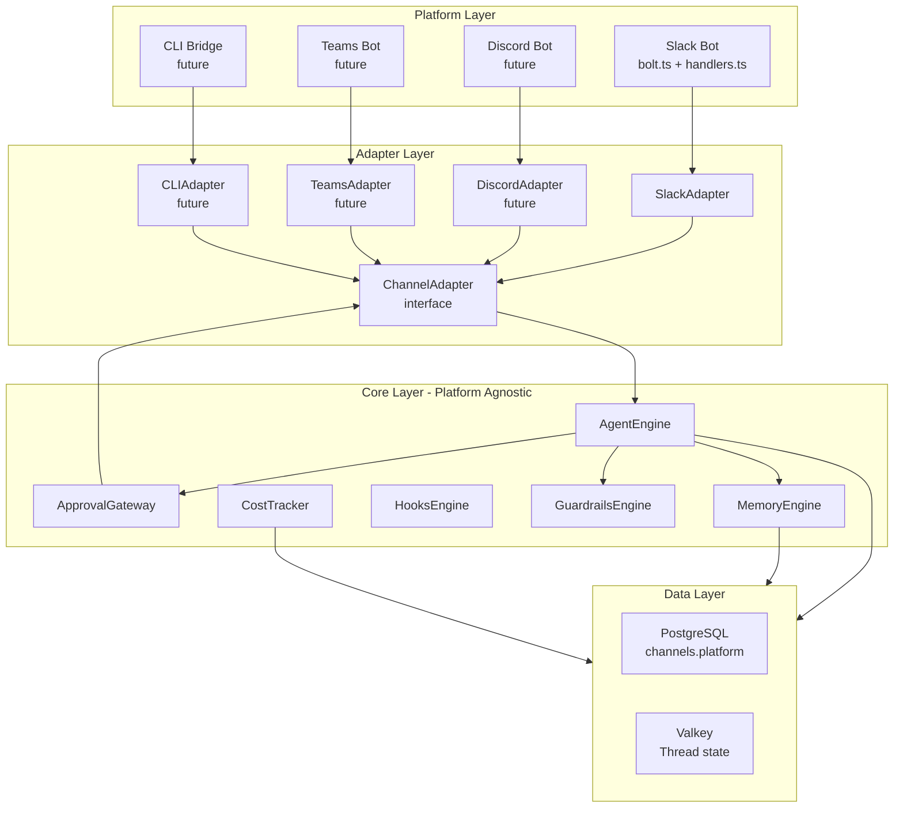

# Channel Adapter Architecture

> Multi-platform channel abstraction for PersonalClaw. Updated: February 2026.

## Table of Contents

1. [Overview](#overview)
2. [Architecture Diagram](#architecture-diagram)
3. [ChannelAdapter Interface](#channeladapter-interface)
4. [Data Model](#data-model)
5. [Platform ID Mapping](#platform-id-mapping)
6. [How to Add a New Platform](#how-to-add-a-new-platform)
7. [Boundary Rules](#boundary-rules)
8. [Platform Considerations](#platform-considerations)

---

## Overview

PersonalClaw supports multiple messaging platforms through a `ChannelAdapter` interface. The agent engine, approval gateway, memory engine, and all core logic are completely platform-agnostic — they never import or reference any platform SDK.

Each messaging platform (Slack, Discord, Teams, CLI) has its own adapter that implements the `ChannelAdapter` interface. Platform-specific code lives exclusively in its own directory under `apps/api/src/platforms/`.

Currently implemented: **Slack** (`apps/api/src/platforms/slack/adapter.ts`)

---

## Architecture Diagram



---

## ChannelAdapter Interface

Defined in `apps/api/src/channels/adapter.ts`:

```typescript
export interface ChannelAdapter {
  /**
   * Send a text message in the given thread.
   *
   * The adapter is responsible for mapping `threadId` to the platform's
   * native threading mechanism (e.g., Slack's `thread_ts`, Discord's
   * message reply, etc.).
   */
  sendMessage(threadId: string, text: string): Promise<void>;

  /**
   * Request approval from the user before executing a tool.
   *
   * The adapter renders platform-appropriate UI (Slack Block Kit buttons,
   * Discord embed buttons, CLI stdin prompt, etc.) and waits for the user
   * to respond.
   *
   * Returns `true` if the user approves, `false` if denied or timed out.
   * Must NOT throw on timeout — return `false` instead.
   */
  requestApproval(params: {
    threadId: string;
    toolName: string;
    args: Record<string, unknown>;
  }): Promise<boolean>;

  /**
   * Request approval for a multi-step execution plan.
   *
   * Similar to `requestApproval`, but displays a plan summary and ordered
   * steps instead of a single tool call.
   *
   * Returns `true` if approved, `false` if rejected or timed out.
   * Must NOT throw on timeout — return `false` instead.
   */
  requestPlanApproval(params: {
    threadId: string;
    planSummary: string;
    steps: string[];
  }): Promise<boolean>;
}
```

### Contract

| Method                | Must                                       | Must Not                                           |
| --------------------- | ------------------------------------------ | -------------------------------------------------- |
| `sendMessage`         | Deliver the message in the correct thread  | Throw on network errors (log and retry internally) |
| `requestApproval`     | Return `false` on timeout (default: 5 min) | Block indefinitely                                 |
| `requestPlanApproval` | Show all steps to the user                 | Modify or filter the steps                         |

### Error Handling

- Adapters should catch platform SDK errors internally and either retry or return a safe default (`false` for approvals).
- The agent engine treats a `false` return as "denied" and informs the user accordingly.

---

## Data Model

### `channels` Table

| Column          | Type | Description                                                        |
| --------------- | ---- | ------------------------------------------------------------------ |
| `id`            | UUID | Internal primary key                                               |
| `platform`      | text | Platform discriminator: `'slack'`, `'discord'`, `'teams'`, `'cli'` |
| `external_id`   | text | Platform-specific channel ID (e.g., Slack's `C0123ABCDEF`)         |
| `external_name` | text | Human-readable channel name (e.g., `#general`)                     |
| ...             | ...  | All other config columns (model, provider, etc.)                   |

**Composite unique constraint**: `(platform, external_id)` — the same external ID can exist on different platforms.

### `conversations` Table

| Column               | Type | Description                                                            |
| -------------------- | ---- | ---------------------------------------------------------------------- |
| `external_thread_id` | text | Platform's thread identifier (Slack: `thread_ts`, Discord: message ID) |

### `usage_logs` Table

| Column               | Type | Description                  |
| -------------------- | ---- | ---------------------------- |
| `external_user_id`   | text | Platform's user identifier   |
| `external_thread_id` | text | Platform's thread identifier |

### `channel_memories` Table

| Column             | Type | Description                                |
| ------------------ | ---- | ------------------------------------------ |
| `source_thread_id` | text | Thread where the memory was extracted from |

### TypeScript Types

```typescript
// packages/shared/src/types.ts
export type ChannelPlatform = "slack" | "discord" | "teams" | "cli";

export interface ChannelConfig {
  id: string;
  platform: ChannelPlatform;
  externalId: string;
  externalName: string | null;
  // ... config fields
}
```

---

## Platform ID Mapping

Each platform has its own identifier format for channels, threads, and users:

| Concept    | Slack                                   | Discord                   | Teams           | CLI          |
| ---------- | --------------------------------------- | ------------------------- | --------------- | ------------ |
| Channel ID | `C0123ABCDEF`                           | Guild + Channel snowflake | Conversation ID | Session UUID |
| Thread ID  | `thread_ts` (e.g., `1234567890.123456`) | Message snowflake         | Reply chain ID  | Session UUID |
| User ID    | `U0123ABCDEF`                           | User snowflake            | AAD Object ID   | `local`      |

All IDs are stored as opaque strings in `external_id`, `external_thread_id`, and `external_user_id`. The core engine never interprets or validates these formats — only the platform adapter creates and understands them.

---

## How to Add a New Platform

### Step 1: Create the Adapter

Create `apps/api/src/platforms/<platform>/adapter.ts`:

```typescript
import type { ChannelAdapter } from '../../channels/adapter';

export class DiscordAdapter implements ChannelAdapter {
  constructor(
    private channelId: string,
    // ... platform-specific dependencies (Discord.js client, etc.)
  ) {}

  async sendMessage(threadId: string, text: string): Promise<void> {
    // Send via Discord API
  }

  async requestApproval(params: { ... }): Promise<boolean> {
    // Render Discord embed with buttons, wait for interaction
  }

  async requestPlanApproval(params: { ... }): Promise<boolean> {
    // Render plan as Discord embed, wait for interaction
  }
}
```

### Step 2: Create the Platform Plugin

Create `apps/api/src/platforms/<platform>/plugin.ts`:

```typescript
import { getLogger } from "@logtape/logtape";
import type { PlatformPlugin } from "../types";

const logger = getLogger(["personalclaw", "platforms", "discord"]);

export function createDiscordPlugin(): PlatformPlugin {
  return {
    name: "discord",
    async initialize() {
      if (!Bun.env.DISCORD_BOT_TOKEN) {
        logger.warn`Discord token not configured, skipping initialization`;
        return;
      }
      // Initialize Discord.js client, register event handlers
    },
    async shutdown() {
      // Graceful disconnect
    },
  };
}
```

### Step 3: Create the Handler

Create `apps/api/src/platforms/<platform>/handlers.ts`:

```typescript
import { DiscordAdapter } from "./adapter";

export async function handleDiscordMessage(/* platform-specific params */) {
  const adapter = new DiscordAdapter(channelId /* ... */);
  // The agent orchestrator handles engine.run(), not the handler directly
}
```

### Step 4: Register in Platform Registry

In `apps/api/src/index.ts`, register the plugin via the platform registry:

```typescript
import { platformRegistry } from "./platforms/registry";
import { createDiscordPlugin } from "./platforms/discord/plugin";

platformRegistry.register(createDiscordPlugin());
await platformRegistry.initializeAll();
```

### Step 5: Add Frontend Icon

In `apps/web/src/components/channel-sidebar.tsx`, the platform icons are already mapped:

```typescript
const PLATFORM_ICONS: Record<ChannelPlatform, typeof MessageSquare> = {
  slack: MessageSquare,
  discord: Hash,
  teams: Monitor,
  cli: Terminal,
};
```

No changes needed if you added the platform to `ChannelPlatform`. If adding a completely new platform, add it to:

- `packages/shared/src/types.ts` → `ChannelPlatform`
- `packages/shared/src/schemas.ts` → `channelPlatformSchema`
- `apps/web/src/components/channel-sidebar.tsx` → `PLATFORM_ICONS` and `PLATFORM_LABELS`

### Step 6: Add Environment Variables

Add platform-specific env vars to `.env.example`:

```env
# Discord (optional)
DISCORD_BOT_TOKEN=
DISCORD_APPLICATION_ID=
```

---

## Boundary Rules

These boundaries ensure the core engine remains platform-agnostic:

| Directory                            | Allowed Imports                             | Forbidden                                     |
| ------------------------------------ | ------------------------------------------- | --------------------------------------------- |
| `apps/api/src/agent/`                | `ChannelAdapter` from `../channels/adapter` | `@slack/bolt`, `discord.js`, any platform SDK |
| `apps/api/src/hooks/`                | `@personalclaw/shared` types                | Platform-specific identifiers                 |
| `packages/shared/`                   | Standard library only                       | `slack`, `discord` in field names             |
| `packages/db/`                       | `drizzle-orm`                               | Platform-prefixed column names                |
| `apps/api/src/platforms/slack/`      | `@slack/bolt`, `SlackAdapter`               | (Platform-specific code lives here)           |
| `apps/api/src/platforms/<platform>/` | Platform SDK, `<Platform>Adapter`           | Cross-platform imports                        |

These can be enforced via ESLint `no-restricted-imports` rules.

---

## Platform Considerations

| Aspect             | Slack                          | Discord                   | Teams                 | CLI                |
| ------------------ | ------------------------------ | ------------------------- | --------------------- | ------------------ |
| **Transport**      | Socket Mode (WebSocket)        | Gateway (WebSocket)       | Bot Framework (HTTP)  | stdin/stdout       |
| **Threading**      | `thread_ts` parent message     | Message reply chain       | Reply chain           | Session-based      |
| **Approval UI**    | Block Kit buttons              | Embed + ActionRow buttons | Adaptive Card buttons | stdin prompt (y/n) |
| **File Upload**    | Slack Files API → download URL | Attachment URL            | Graph API             | Local file path    |
| **Rate Limits**    | Tier-based (Web API)           | Global + per-route        | Per-app throttling    | None               |
| **Auth Model**     | OAuth2 Bot Token               | Bot Token                 | AAD App Registration  | None               |
| **Message Format** | Markdown (mrkdwn)              | Markdown                  | Adaptive Cards / HTML | Plain text         |
