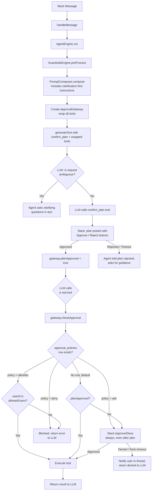
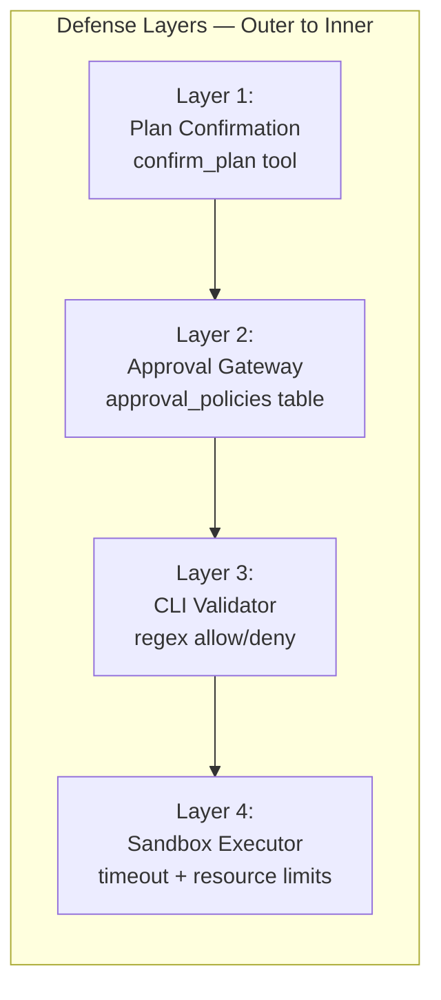

# PersonalClaw Safeguards

> Human-in-the-loop approval system for safe AI agent execution. Updated: February 2026.

## Table of Contents

1. [Overview and Threat Model](#overview-and-threat-model)
2. [Two-Layer Architecture](#two-layer-architecture)
3. [Approval Policy Configuration](#approval-policy-configuration)
4. [UX Flow Examples](#ux-flow-examples)
5. [Developer Guide](#developer-guide)
6. [Timeout and Error Behavior](#timeout-and-error-behavior)
7. [Audit Trail](#audit-trail)

---

## Overview and Threat Model

PersonalClaw executes tools on behalf of users in messaging channels. Without safeguards, the LLM could autonomously run destructive commands, act on ambiguous requests without clarification, or perform actions the user never intended.

### Threats Addressed

| Threat | Example | Mitigation |
|--------|---------|------------|
| Unsolicited actions | LLM runs extra tools "to be helpful" | Plan confirmation gates all tool execution |
| Ambiguous intent | User says "delete it" — delete what? | System prompt enforces clarification before action |
| Destructive tool calls | `aws ec2 terminate-instances` | CLI regex validator + per-tool approval policies |
| Prompt injection | Input tricks the LLM into calling tools | Guardrails pre-processing + plan confirmation adds a human checkpoint |
| Unauthorized access | User runs tools they shouldn't have access to | Per-tool allowlist policy restricts by user ID |

### Design Principles

- **Defense in depth**: Multiple independent layers, each sufficient to block unauthorized actions
- **Fail-closed**: If any safeguard layer cannot determine safety, it denies the action
- **Human authority**: The human always has final say — no tool executes without explicit or policy-based approval
- **Transparency**: Every approval decision is logged, every denial is reported to the user

---

## Two-Layer Architecture

PersonalClaw enforces two independent safeguard layers before any tool executes:



### Layer 1 — Clarification and Plan Confirmation

**Purpose**: Ensure the agent understands the user's intent before taking any action.

**How it works**:

1. The system prompt (`prompt-composer.ts`) instructs the agent to ask clarifying questions when a request is ambiguous, has multiple interpretations, or is missing critical details.

2. Before executing ANY tools, the agent must call the `confirm_plan` tool, which:
   - Posts a structured plan to the thread with the summary and ordered steps
   - Displays **Approve** and **Reject** buttons
   - Blocks execution until the user responds or 5 minutes elapse

3. On approval, `gateway.planApproved` is set to `true`, granting default access to tools without explicit policies.

4. On rejection or timeout, the agent asks the user what to change and presents a revised plan.

**Key file**: `apps/api/src/agent/approval-gateway.ts` — `getConfirmPlanTool()` method

### Layer 2 — Per-Tool Approval Gateway

**Purpose**: Enforce configurable, per-tool authorization policies at the channel level.

**How it works**:

1. Every tool's `execute` function is wrapped by `ApprovalGateway.wrapTools()` before being passed to `generateText()`.

2. When the LLM calls a tool, the wrapper runs `checkApproval()` before the original `execute` function:
   - Queries the `approval_policies` table for a matching `(channel_id, tool_name)` row
   - Applies the policy: `deny`, `auto`, `allowlist`, or `ask`
   - If no policy row exists: auto-execute if plan was approved, otherwise prompt for individual approval

3. Denied tools return an error message to the LLM (not silent failure).

**Key file**: `apps/api/src/agent/approval-gateway.ts` — `checkApproval()` and `wrapTools()` methods

### How the Layers Interact

| Plan approved? | Tool has explicit policy? | What happens |
|----------------|--------------------------|--------------|
| Yes | No policy row | Tool auto-executes |
| Yes | `ask` | Individual Slack approval required |
| Yes | `auto` | Tool auto-executes |
| Yes | `allowlist` | Auto-execute if user is in list, deny otherwise |
| Yes | `deny` | Tool is blocked |
| No | Any / none | Individual Slack approval required for every tool |

---

## Approval Policy Configuration

Channel admins configure per-tool approval policies via the dashboard API. Policies are stored in the `approval_policies` table.

### Policy Types

| Policy | Behavior | Use Case |
|--------|----------|----------|
| `ask` | Always show Approve/Deny UI, even after plan approval | High-risk tools: CLI commands, write operations |
| `allowlist` | Auto-execute if the requesting user ID is in `allowedUsers`, deny otherwise | Restrict tools to specific team members |
| `deny` | Tool is never executed, error returned to LLM | Disable tools entirely for a channel |
| `auto` | Tool always auto-executes, no approval needed | Low-risk read-only tools: `memory_search`, `memory_list` |

### Default Behavior

If no `approval_policies` row exists for a tool:
- **After plan approval**: the tool auto-executes
- **Without plan approval**: individual Slack approval is required

This means the system is safe by default — the only way to skip approval is through an explicit plan confirmation or an explicit `auto` policy.

### API Reference

**List policies for a channel:**

```
GET /api/approvals/:channelId
```

**Create a policy:**

```
POST /api/approvals
Content-Type: application/json

{
  "channelId": "uuid-of-channel",
  "toolName": "aws_cli",
  "policy": "ask",
  "allowedUsers": []
}
```

**Delete a policy:**

```
DELETE /api/approvals/:id
```

### Configuration Examples

**Allow memory tools to auto-execute for everyone:**

```json
{ "channelId": "...", "toolName": "memory_search", "policy": "auto" }
{ "channelId": "...", "toolName": "memory_list", "policy": "auto" }
{ "channelId": "...", "toolName": "memory_save", "policy": "auto" }
```

**Require individual approval for all CLI tools:**

```json
{ "channelId": "...", "toolName": "aws_cli", "policy": "ask" }
{ "channelId": "...", "toolName": "github_cli", "policy": "ask" }
{ "channelId": "...", "toolName": "curl_fetch", "policy": "ask" }
```

**Block browser tools entirely in a channel:**

```json
{ "channelId": "...", "toolName": "browser_screenshot", "policy": "deny" }
{ "channelId": "...", "toolName": "browser_scrape", "policy": "deny" }
{ "channelId": "...", "toolName": "browser_fill", "policy": "deny" }
```

**Auto-execute for specific users only:**

```json
{
  "channelId": "...",
  "toolName": "aws_cli",
  "policy": "allowlist",
  "allowedUsers": ["U0123ALICE", "U0456BOB"]
}
```

### Database Schema

```sql
CREATE TABLE approval_policies (
  id UUID PRIMARY KEY DEFAULT gen_random_uuid(),
  channel_id UUID NOT NULL REFERENCES channels(id) ON DELETE CASCADE,
  tool_name TEXT NOT NULL,
  policy TEXT NOT NULL DEFAULT 'ask',
  allowed_users TEXT[] NOT NULL DEFAULT '{}',
  created_at TIMESTAMPTZ NOT NULL DEFAULT now(),
  UNIQUE (channel_id, tool_name)
);
```

---

## UX Flow Examples

### Clear Request

```
User: "What are our S3 bucket sizes?"

Agent calls confirm_plan:
┌──────────────────────────────────────────────────┐
│ Execution plan — approval required               │
│ Check S3 bucket sizes in your AWS account.       │
│                                                  │
│ Steps:                                           │
│ 1. List all S3 buckets (aws_cli)                 │
│ 2. Get size metrics for each bucket (aws_cli)    │
│                                                  │
│ [Approve]  [Reject]                              │
└──────────────────────────────────────────────────┘

User clicks [Approve]
→ Agent executes tools, responds with bucket sizes
```

### Ambiguous Request

```
User: "Deploy the thing"

Agent (no tools called, just text):
"I'd like to make sure I do the right thing. Could you clarify:
 1. What exactly should be deployed?
 2. Which environment — staging or production?
 3. Any specific branch or version?"

User: "Main branch to staging"

Agent calls confirm_plan:
┌──────────────────────────────────────────────────┐
│ Execution plan — approval required               │
│ Deploy main branch to staging environment.       │
│                                                  │
│ Steps:                                           │
│ 1. Check main branch build status (github_cli)   │
│ 2. Trigger staging deployment (aws_cli)          │
│                                                  │
│ [Approve]  [Reject]                              │
└──────────────────────────────────────────────────┘
```

### Plan Rejection

```
User clicks [Reject]

Agent: "Understood. What would you like changed about the plan?"

User: "Skip the build check, just deploy"

Agent calls confirm_plan:
┌──────────────────────────────────────────────────┐
│ Execution plan — approval required               │
│ Deploy main branch to staging directly.          │
│                                                  │
│ Steps:                                           │
│ 1. Trigger staging deployment (aws_cli)          │
│                                                  │
│ [Approve]  [Reject]                              │
└──────────────────────────────────────────────────┘
```

### Per-Tool Denial (Policy Override)

```
Plan is approved, but aws_cli has policy = 'ask':

Agent calls aws_cli("s3 ls"):
┌──────────────────────────────────────────────────┐
│ Tool approval required                           │
│ Tool: aws_cli                                    │
│ Args: {"command": "s3 ls"}                       │
│                                                  │
│ [Approve]  [Deny]                                │
└──────────────────────────────────────────────────┘

User clicks [Approve] → tool executes
```

### Timeout

```
Agent calls confirm_plan → posts buttons
(5 minutes pass, no response)

Agent posts: "Plan was skipped — no response within 5 minutes.
Let me know if you'd like to try again."
```

### CLI Validator Block (Layer 3)

```
Agent calls aws_cli("ec2 terminate-instances --instance-ids i-123")
→ Approval gateway approves (plan was confirmed)
→ CLI validator blocks: deniedPatterns matches "terminate-"
→ Returns: { error: true, message: "Command blocked: matches denied pattern" }
→ Agent reports the block to the user
```

---

## Developer Guide

### Adding New Tools

When you create a new tool using the Vercel AI SDK `tool()` helper, it is **automatically** wrapped with approval logic by `ApprovalGateway.wrapTools()`. No opt-in is needed.

```typescript
// Example: defining a new tool in apps/api/src/my-feature/tools.ts
import { tool } from 'ai';
import { z } from 'zod';

export function getMyTools() {
  return {
    my_new_tool: tool({
      description: 'Does something useful',
      inputSchema: z.object({
        param: z.string().describe('A required parameter'),
      }),
      execute: async ({ param }) => {
        // Your tool logic — this only runs AFTER approval
        return { result: `processed ${param}` };
      },
    }),
  };
}
```

The approval gateway wraps this tool's `execute` function at runtime. The tool author does not need to add any approval logic.

### Defense Layer Interaction



| Layer | Where it runs | What it gates |
|-------|--------------|---------------|
| Plan Confirmation | Before any tool call | Validates user intent for the entire workflow |
| Approval Gateway | Wraps each tool's `execute` | Per-tool authorization via `approval_policies` |
| CLI Validator | Inside CLI tool `execute` | Blocks destructive shell commands via regex |
| Sandbox Executor | Inside sandboxed tool `execute` | Enforces timeout and resource limits |

**Layer 1 (Plan Confirmation)** runs once per agent interaction.
**Layer 2 (Approval Gateway)** runs per tool call.
**Layers 3–4** run inside specific tool implementations and are independent of the approval system.

### When to Add an Explicit Policy

- **Default behavior is safe**: without a policy row, tools require plan approval or individual approval
- Add `policy: 'ask'` when a tool should **always** require individual approval, even after plan confirmation (e.g., CLI tools, write operations)
- Add `policy: 'auto'` when a tool is safe to auto-execute after plan confirmation (e.g., read-only memory tools)
- Add `policy: 'deny'` to disable a tool for a specific channel entirely
- Add `policy: 'allowlist'` to restrict a tool to specific users

### ToolCallRecord Metadata

The `ToolCallRecord` type in `@personalclaw/shared` captures approval metadata for audit:

```typescript
interface ToolCallRecord {
  toolName: string;
  args: Record<string, unknown>;
  result: unknown;
  durationMs: number;
  requiresApproval: boolean;  // Whether the tool went through approval
  approved: boolean | null;   // true = approved, false = denied, null = not applicable
}
```

### Testing Approval Flows

To test approval in unit tests, mock the `SayFn` and simulate button clicks:

```typescript
import { describe, expect, mock, test } from 'bun:test';
import { ApprovalGateway } from './approval-gateway';

describe('ApprovalGateway', () => {
  test('plan approval grants default tool access', async () => {
    const mockSay = mock(() => Promise.resolve());
    const gateway = new ApprovalGateway('channel-1', 'thread-1', 'user-1', mockSay);

    gateway.planApproved = true;
    const result = await gateway.checkApproval('memory_search', { query: 'test' });

    expect(result).toBe(true);
  });

  test('deny policy blocks tool regardless of plan', async () => {
    const mockSay = mock(() => Promise.resolve());
    const gateway = new ApprovalGateway('channel-1', 'thread-1', 'user-1', mockSay);

    gateway.planApproved = true;
    // Insert a 'deny' policy row for the test channel/tool, then:
    const result = await gateway.checkApproval('blocked_tool', {});

    expect(result).toBe(false);
  });
});
```

---

## Timeout and Error Behavior

### Timeout Duration

Both plan approval and per-tool approval use a **5-minute (300,000 ms)** timeout. If the user does not respond within this window, the action is denied.

### What Happens on Timeout

1. The pending approval is removed from the in-memory map
2. A notification is posted in the thread:
   - Plan timeout: *"Plan was skipped — no response within 5 minutes. Let me know if you'd like to try again."*
   - Tool timeout: *"Tool `tool_name` was skipped — no response within 5 minutes."*
3. The `execute` wrapper returns an error result to the LLM:
   ```json
   { "error": true, "message": "Tool \"tool_name\" was denied or timed out. Ask the user if they want to retry." }
   ```
4. The LLM receives this error and is instructed to inform the user and ask if they want to retry

### What the LLM Receives on Denial

Denials are never silent. The wrapped tool returns a structured error:

| Scenario | Return value to LLM |
|----------|-------------------|
| Policy = `deny` | `{ error: true, message: "Tool \"X\" was denied or timed out..." }` |
| Policy = `allowlist`, user not in list | `{ error: true, message: "Tool \"X\" was denied or timed out..." }` |
| User clicks Deny | `{ error: true, message: "Tool \"X\" was denied or timed out..." }` |
| 5-minute timeout | `{ error: true, message: "Tool \"X\" was denied or timed out..." }` |
| Plan rejected | `{ approved: false, message: "Plan was rejected or timed out..." }` |

### Agent Recovery

The system prompt instructs the agent to:
1. Report the denial to the user
2. Ask if they want to retry or take a different approach
3. Never silently skip a failed step

---

## Audit Trail

Every approval decision is recorded via the lifecycle hooks system.

### Hook Events

The `tool:called` hook is emitted on every approval check with the following payload:

```typescript
{
  channelId: string;
  externalUserId: string;
  threadId: string;
  eventType: 'tool:called';
  payload: {
    toolName: string;
    args: Record<string, unknown>;
    approved: boolean;
    policy: 'ask' | 'allowlist' | 'deny' | 'auto' | 'default';
  };
}
```

### Built-in Audit Hook

The `audit-trail.ts` built-in hook (`apps/api/src/hooks/builtin/audit-trail.ts`) logs all `message:sent` events. Extend it to also capture `tool:called` events for a complete audit trail of tool approvals.

### ToolCallRecord in Conversations

Tool calls are stored in the `conversations` table as part of `ConversationMessage.toolCalls`. Each record includes:

- `toolName` — which tool was called
- `args` — the arguments passed
- `result` — what the tool returned
- `durationMs` — how long the tool took
- `requiresApproval` — whether the tool went through approval
- `approved` — the approval decision (`true`, `false`, or `null`)

### Querying Audit Data

Tool approval history can be extracted from the `conversations` table by examining the `messages` JSONB column:

```sql
SELECT
  c.channel_id,
  c.external_thread_id,
  msg->>'timestamp' AS message_ts,
  tc->>'toolName' AS tool_name,
  tc->>'approved' AS approved
FROM conversations c,
  jsonb_array_elements(c.messages) AS msg,
  jsonb_array_elements(msg->'toolCalls') AS tc
WHERE tc->>'requiresApproval' = 'true'
ORDER BY msg->>'timestamp' DESC;
```
