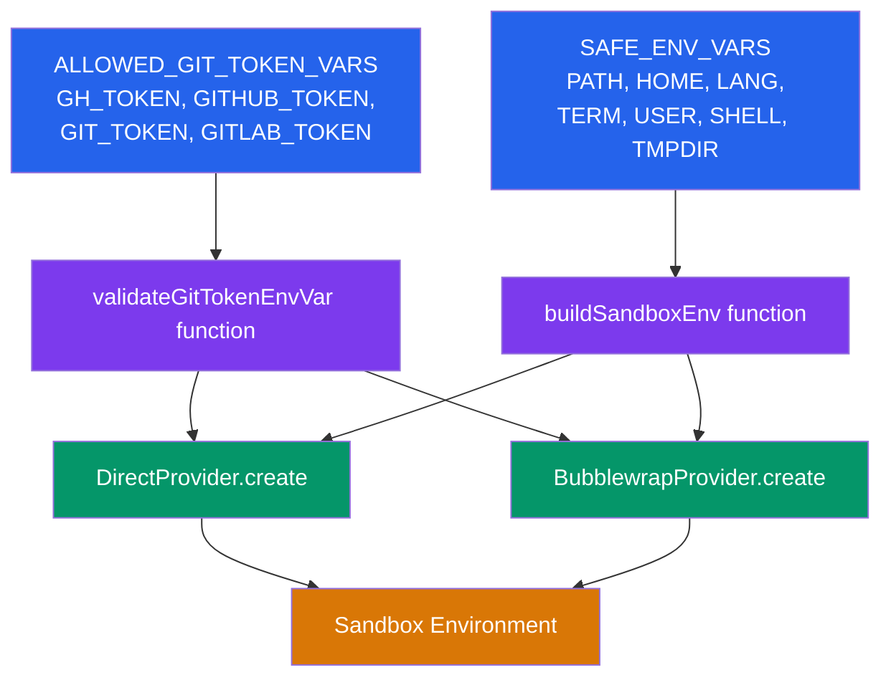

# Data Model: Sandbox Environment Variable Allowlist

**Date**: 2026-04-06
**Feature**: `20260406-201317-sandbox-env-allowlist`

## Entities

### SAFE_ENV_VARS (constant)

A hardcoded, read-only array of environment variable names safe to pass from the host into sandboxed processes.

| Field | Value |
|-------|-------|
| Type | `readonly string[]` |
| Location | `apps/api/src/sandbox/security.ts` |
| Mutable | No — hardcoded constant |
| Values | `PATH`, `HOME`, `LANG`, `TERM`, `USER`, `SHELL`, `TMPDIR` |

### ALLOWED_GIT_TOKEN_VARS (constant)

A regex pattern matching the only variable names `gitTokenEnvVar` is allowed to reference.

| Field | Value |
|-------|-------|
| Type | `RegExp` |
| Location | `apps/api/src/sandbox/security.ts` |
| Mutable | No — hardcoded constant |
| Pattern | Matches exactly: GH_TOKEN, GITHUB_TOKEN, GIT_TOKEN, GITLAB_TOKEN |

### Sandbox Environment (computed)

The environment object passed to `Bun.spawn()` or bwrap `--setenv` args. Composed at sandbox creation and command run time.

**Composition order** (later overrides earlier):
1. Allowlisted host variables (from `SAFE_ENV_VARS`, read from `Bun.env`)
2. Provider-configured variables (`envVars` from `create()`)
3. Caller-provided variables (`options.env` from the caller)
4. Sandbox-specific overrides (provider-dependent: DirectSandbox sets `HOME` to the host workspace path; BubblewrapSandbox hardcodes `HOME=/workspace`, `PATH` to a safe default, and `TMPDIR=/tmp`)

## Relationships

## No Database Changes

This feature modifies only runtime behavior in `apps/api/src/sandbox/`. The `SandboxConfig` type in `packages/shared` is unchanged — `gitTokenEnvVar` remains `string | null` with validation enforced at the sandbox creation boundary, not the schema level.
