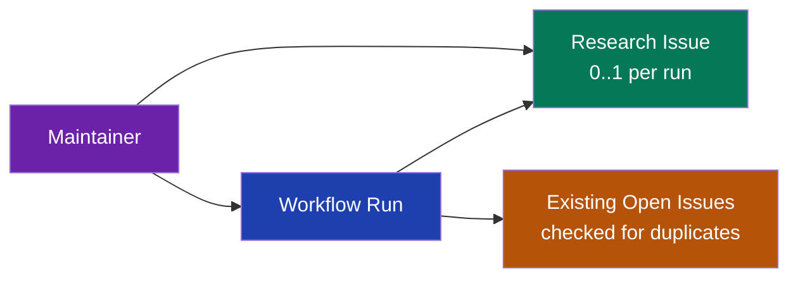

# Data Model: Scheduled Research Workflow

**Date**: 2026-04-08 | **Branch**: `20260408-190912-scheduled-research-workflow`

## Overview

This feature introduces no new database entities, tables, or schema changes. The data model consists entirely of GitHub-native entities managed through the GitHub API.

## Entities

### Research Issue (GitHub Issue)

**Storage**: GitHub Issues API (not in application database)

| Field | Type | Description |
| ----- | ---- | ----------- |
| title | string | Format: `research: [area] - [summary]` |
| body | markdown | Structured template: finding, rationale, references, next steps |
| labels | string[] | Always includes `research` label; may include area-specific labels |
| state | enum | `open` (created by workflow) or `closed` (manually triaged by maintainer) |

**Lifecycle**:
1. **Created** by the workflow when a finding is identified
2. **Open** for manual triage by the maintainer
3. **Closed** when the maintainer acts on or dismisses the finding

### Workflow Configuration (YAML)

**Storage**: `.github/workflows/research.yml` (checked into repository)

| Field | Type | Description |
| ----- | ---- | ----------- |
| schedule.cron | string | `0 */12 * * *` (every 12 hours) |
| workflow_dispatch.inputs.focus_area | string (optional) | Area to focus research on |
| secrets.ANTHROPIC_API_KEY | secret | Anthropic API key for Claude Code |
| secrets.PERSONAL_ACCESS_TOKEN | secret | PAT for GitHub API auth on cron triggers |

## Relationships

## No Database Migrations Required

This feature operates entirely within the GitHub ecosystem (Actions + Issues). No changes to `packages/db/` schema, migrations, or seed data.
