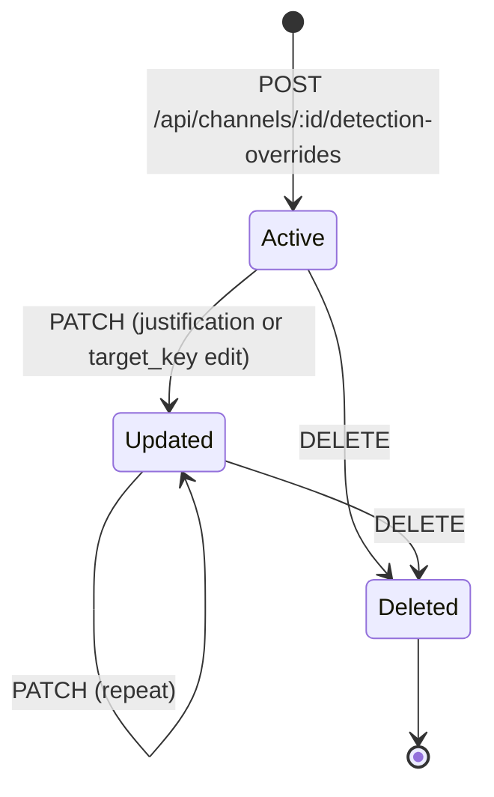
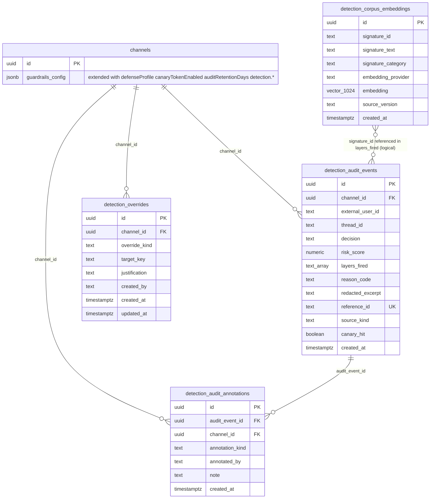

# Phase 1 Data Model: Multi-Layer Prompt Injection Defense Pipeline

**Date**: 2026-04-09
**Branch**: `20260409-185147-injection-defense-pipeline`
**Plan**: [plan.md](./plan.md) | **Research**: [research.md](./research.md)

This document defines every persistent and in-process entity introduced by this feature, along with their fields, relationships, validation rules, and state transitions. Every field in every persistent table maps to a specific functional requirement in `spec.md`.

---

## 1. Persistent entities (new DB tables)

### 1.1 `detection_audit_events` (FR-026)

**Purpose**: System of record for every block, flag, and above-threshold allow decision produced by the detection pipeline.

**Schema** (Drizzle, to be created at `packages/db/src/schema/detection-audit-events.ts`):

| Column | Type | Constraints | Notes |
|---|---|---|---|
| `id` | `uuid` | primary key, `defaultRandom()` | |
| `channel_id` | `uuid` | `not null`, `references(channels.id, onDelete: 'cascade')` | Constitution III: channel isolation |
| `external_user_id` | `text` | `not null` | Who submitted the triggering input |
| `thread_id` | `text` | `nullable` | Null for non-thread sources (e.g., `generate_skill_input`) |
| `decision` | `text` | `not null`, CHECK constraint enforced via Zod on write: one of `allow`, `flag`, `neutralize`, `block` | FR-003 |
| `risk_score` | `numeric(5,2)` | `not null`, bounded `0.00`–`100.00` by Zod | FR-003 |
| `layers_fired` | `text[]` | `not null`, `default '{}'` | Ordered list of layer names that contributed to the decision, e.g., `['normalize', 'similarity:corpus_v1_sig_042']` |
| `reason_code` | `text` | `not null` | Stable machine-readable reason, e.g., `HOMOGLYPH_IGNORE_PHRASE`, `CLASSIFIER_ADVERSARIAL`, `CANARY_LEAK` |
| `redacted_excerpt` | `text` | `not null` | Up to 500 chars of the triggering input, with PII masked by `maskPII()` from `apps/api/src/utils/pii-masker.ts` |
| `reference_id` | `text` | `not null`, unique | Short token (nanoid 12-char) shown to users per FR-004 for admin lookup |
| `source_kind` | `text` | `not null`, CHECK via Zod: one of `user_message`, `tool_result`, `memory_recall`, `generate_skill_input`, `conversation_history`, `canary_leak` | FR-026 |
| `canary_hit` | `boolean` | `not null`, `default false` | True when decision was triggered by the output-side canary layer (FR-020) |
| `created_at` | `timestamptz` | `not null`, `defaultNow()` | Constitution §Database requires this column |

**Indexes**:

- `btree (channel_id, created_at DESC)` — primary query path for admin recent-blocks view (FR-015) and for FR-028 retention cleanup
- `btree (decision, created_at DESC)` — for aggregate dashboards grouped by decision
- `btree (reference_id)` — implicit via `unique` constraint; supports FR-004 lookup by reference id

**Validation rules**:

- `decision` must be one of four literal strings (enforced by Zod on insert path)
- `risk_score` must be in `[0, 100]` (Zod `z.number().min(0).max(100)`)
- `reference_id` must be a 12-character nanoid alphabet, unique
- `redacted_excerpt` MUST be PII-masked before insert — any code path that inserts into this table MUST go through the `audit.ts` helper that applies `maskPII()` first
- `layers_fired` must be non-empty for `decision !== 'allow'`

**State transitions**: None. Audit events are immutable. The retention job (FR-028) hard-deletes rows; it does not update them. Admin "mark as false positive" (FR-015) is a separate per-row annotation — this is modeled as a second table in section 1.2 to preserve the immutability invariant.

**Retention**: Per FR-022 and FR-028, rows are deleted after `auditRetentionDays` has elapsed since `created_at`. Default 7 days, per-channel overridable in `guardrailsConfig.auditRetentionDays`, bounded `[1, 90]`.

---

### 1.2 `detection_audit_annotations` (FR-015)

**Purpose**: Per-row annotations applied by admins for triage, without mutating the immutable audit event itself.

**Schema** (Drizzle, at `packages/db/src/schema/detection-audit-annotations.ts`):

| Column | Type | Constraints | Notes |
|---|---|---|---|
| `id` | `uuid` | primary key, `defaultRandom()` | |
| `audit_event_id` | `uuid` | `not null`, `references(detection_audit_events.id, onDelete: 'cascade')` | |
| `channel_id` | `uuid` | `not null`, `references(channels.id, onDelete: 'cascade')` | Denormalized for channel-scoped queries |
| `annotation_kind` | `text` | `not null`, CHECK via Zod: `false_positive`, `confirmed_true_positive`, `under_review` | FR-015 |
| `annotated_by` | `text` | `not null` | `external_user_id` of the admin who annotated |
| `note` | `text` | `nullable` | Free-form reviewer note |
| `created_at` | `timestamptz` | `not null`, `defaultNow()` | |

**Indexes**:

- `btree (channel_id, created_at DESC)`
- `btree (audit_event_id)` — for joining back to the event

**Validation rules**:

- Only channel admins may insert (enforced at route level via `channels.channelAdmins` membership check)
- At most one annotation per audit event per admin (enforced by a `unique` constraint on `(audit_event_id, annotated_by)` — to be added in the migration)

**State transitions**: annotations are immutable once written. To change a decision, write a new annotation.

**Retention**: Annotations are cascaded when the audit event is deleted by the retention job (via `ON DELETE CASCADE`).

---

### 1.3 `detection_overrides` (FR-033)

**Purpose**: Per-channel allowlist and block-override entries that tune detection without modifying the committed base corpus.

**Schema** (Drizzle, at `packages/db/src/schema/detection-overrides.ts`):

| Column | Type | Constraints | Notes |
|---|---|---|---|
| `id` | `uuid` | primary key, `defaultRandom()` | |
| `channel_id` | `uuid` | `not null`, `references(channels.id, onDelete: 'cascade')` | Channel-scoped per FR-033 |
| `override_kind` | `text` | `not null`, CHECK via Zod: `allowlist_signature`, `block_phrase`, `trust_mcp_tool` | Three distinct behaviors |
| `target_key` | `text` | `not null` | For `allowlist_signature`: a `signature_id` from the base corpus; for `block_phrase`: the raw phrase; for `trust_mcp_tool`: the MCP tool name |
| `justification` | `text` | `not null` | Free-form rationale shown in the admin view and reviewed on change |
| `created_by` | `text` | `not null` | `external_user_id` of the admin |
| `created_at` | `timestamptz` | `not null`, `defaultNow()` | |
| `updated_at` | `timestamptz` | `not null`, `defaultNow()` | |

**Indexes**:

- `btree (channel_id)` — for per-turn lookup
- `unique (channel_id, override_kind, target_key)` — prevents duplicate overrides

**Validation rules**:

- `override_kind` enum enforced by Zod on insert
- For `allowlist_signature`: `target_key` must match a known signature id in the current committed corpus (lookup at insert time; log-only warning if unknown, because the corpus version may advance)
- For `block_phrase`: `target_key` must be between 3 and 500 characters (prevent single-character blanket blocks and unbounded storage)
- For `trust_mcp_tool`: `target_key` must match a tool name currently exposed by an enabled MCP config for the channel

**State transitions**:



**Retention**: Not subject to automated retention. Admin-driven lifecycle.

**Cache invalidation**: Any insert, update, or delete calls `invalidateConfig(channelId)` from `apps/api/src/channels/config-cache.ts` so the next turn picks up the new overrides within one cache TTL cycle (consistent with FR-018).

---

### 1.4 `detection_corpus_embeddings` (R5 from research, supporting FR-002(d) and FR-032)

**Purpose**: Cached 1024-dim embeddings of the committed base corpus, generated at API process startup. Not channel-scoped — the base corpus is a shared, global resource per FR-032.

**Schema** (Drizzle, at `packages/db/src/schema/detection-corpus-embeddings.ts`):

| Column | Type | Constraints | Notes |
|---|---|---|---|
| `id` | `uuid` | primary key, `defaultRandom()` | |
| `signature_id` | `text` | `not null` | Stable id from `signatures.json` |
| `signature_text` | `text` | `not null` | Original text (for debugging and re-embedding on provider change) |
| `signature_category` | `text` | `not null`, CHECK via Zod: `paraphrase`, `multilingual`, `encoded`, `system_override`, `role_play`, `exfiltration` | Taxonomy for per-category stats |
| `embedding_provider` | `text` | `not null` | Provider that generated this embedding (`openai`, `bedrock`, `ollama`) |
| `embedding` | `vector(1024)` | `not null` | pgvector column — created via raw SQL in the migration (Constitution §Database allows this) |
| `source_version` | `text` | `not null` | `schemaVersion` from `signatures.json` at generation time |
| `created_at` | `timestamptz` | `not null`, `defaultNow()` | |

**Indexes**:

- `unique (signature_id, embedding_provider, source_version)` — startup idempotent upsert key
- HNSW index on `embedding` using `vector_cosine_ops` — created via raw SQL, matching the pattern at `packages/db/src/migrations/0006_embedding_1024.sql:10-11`

**Validation rules**:

- `embedding` must be 1024 dimensions (enforced at generation time by `generateEmbedding()` at `apps/api/src/memory/embeddings.ts:12`)
- `source_version` must be a non-empty string

**State transitions**: managed entirely by `initDetectionCorpus()` at API startup. On boot:

1. Parse `signatures.json` from `packages/shared/src/injection-corpus/signatures.json`
2. For each signature: compute the lookup key `(signature_id, currentProvider, currentSourceVersion)`
3. If a row exists for that key, skip
4. Otherwise, call `generateEmbedding(signature.text)` and insert
5. Log total rows generated / skipped / failed. Per R10, any failure causes a fatal boot error.

**Retention**: not subject to automated retention. Old rows (from prior `source_version`) remain until a future cleanup job is added; they are never queried because the lookup uses the current version.

---

## 2. Schema extensions (existing tables)

### 2.1 `channels.guardrails_config` (`jsonb`) — extended via Zod schema

**Current** (`packages/shared/src/schemas.ts:33-43`):

```typescript
guardrailsConfigSchema = z.object({
  preProcessing: z.object({
    contentFiltering: z.boolean().default(true),
    intentClassification: z.boolean().default(false),
    maxInputLength: z.number().int().positive().default(10000),
  }),
  postProcessing: z.object({
    piiRedaction: z.boolean().default(false),
    outputValidation: z.boolean().default(true),
  }),
});
```

**Extended** (proposed shape — exact implementation in Phase 2):

```typescript
guardrailsConfigSchema = z.object({
  preProcessing: z.object({
    contentFiltering: z.boolean().default(true),           // Existing — kept for back-compat derivation (FR-023)
    intentClassification: z.boolean().default(false),      // DEPRECATED per FR-024 — ignored, logged once
    maxInputLength: z.number().int().positive().default(10000),
  }),
  postProcessing: z.object({
    piiRedaction: z.boolean().default(false),
    outputValidation: z.boolean().default(true),
  }),

  // New fields — all optional with safe defaults, backward-compatible per FR-023
  defenseProfile: z.enum(['strict', 'balanced', 'permissive']).optional(),  // Derived at load time if absent
  canaryTokenEnabled: z.boolean().default(true),            // FR-021
  auditRetentionDays: z.number().int().min(1).max(90).default(7),  // FR-022
  detection: z.object({
    heuristicThreshold: z.number().min(0).max(100).default(60),   // Risk score above which heuristic layer flags
    similarityThreshold: z.number().min(0).max(1).default(0.85),  // Cosine similarity above which similarity layer FIRES and contributes to the decision
    similarityShortCircuitThreshold: z.number().min(0).max(1).default(0.92),  // Cosine similarity above which the similarity layer SHORT-CIRCUITS the pipeline (skips the LLM classifier); must be ≥ similarityThreshold
    classifierEnabled: z.boolean().default(true),                  // Allow disabling the LLM classifier for cost-sensitive channels (still subject to FR-008 floor)
    classifierTimeoutMs: z.number().int().positive().default(3000), // Fail-closed (strict) or fail-open (permissive) on timeout
  }).default({}),
});
```

**Back-compat derivation** (FR-023): when `defenseProfile` is absent in a loaded row, the `GuardrailsEngine` computes it at load time:

- `contentFiltering === false` → `defenseProfile = 'permissive'`
- `contentFiltering === true`:
  - If the channel has any approval policy with `policy !== 'auto'` (verified by querying `approval_policies`) → `defenseProfile = 'strict'`
  - Otherwise → `defenseProfile = 'balanced'`

The derivation is deterministic and idempotent — it runs on every config load (cheap since `approval_policies` is already cached) and never writes back to the row (FR-023: no write-time migration).

**Deprecation handling for `intentClassification`** (FR-024): the first time any channel loads a config where `intentClassification === true`, the `GuardrailsEngine` logs a `WARN` level deprecation notice via LogTape (category `['personalclaw', 'guardrails', 'deprecated']`), with a `{ once: true }` flag tracked in a module-level `Set<channelId>` to suppress repeat logs per process. The field is not consulted for any behavior.

---

### 2.2 `HookEventType` — extended

**Current** (`packages/shared/src/types.ts:210-219`):

```typescript
export type HookEventType =
  | 'message:received'
  | 'message:sending'
  | 'message:sent'
  | 'tool:called'
  | 'memory:saved'
  | 'identity:updated'
  | 'budget:warning'
  | 'budget:exceeded'
  | 'reaction:received';
```

**Extended** (FR-027):

```typescript
export type HookEventType =
  | 'message:received'
  | 'message:sending'
  | 'message:sent'
  | 'tool:called'
  | 'memory:saved'
  | 'identity:updated'
  | 'budget:warning'
  | 'budget:exceeded'
  | 'reaction:received'
  | 'guardrail:detection';  // New — emitted as side-channel after detection_audit_events row write
```

The hook emission happens **after** the table write and is best-effort (per FR-027). Callers of `guardrail:detection` consumers are responsible for handling their own failures.

---

## 3. In-process value objects (not persisted)

### 3.1 `DetectionDecision`

**Purpose**: Structured result produced by `detection/engine.ts` for each input. Returned to the pipeline stage that called it.

**Shape**:

```typescript
export type DetectionAction = 'allow' | 'flag' | 'neutralize' | 'block';

export interface DetectionDecision {
  action: DetectionAction;
  riskScore: number;        // 0..100, the maximum score across fired layers
  layersFired: string[];    // Ordered list of layer ids that contributed
  reasonCode: string;       // Stable enum string suitable for programmatic matching
  redactedExcerpt: string;  // Up to 500 chars, PII-masked, for audit
  referenceId: string;      // 12-char nanoid, uniquely identifies this decision
  neutralizedText?: string; // Only set when action === 'neutralize'; the rewritten safe content
  sourceKind: 'user_message' | 'tool_result' | 'memory_recall' | 'generate_skill_input' | 'conversation_history' | 'canary_leak';
}
```

**Validation rules**:

- `action === 'neutralize'` requires `neutralizedText` to be non-empty
- `action !== 'allow'` requires `layersFired.length > 0`
- `riskScore` must be in `[0, 100]`

---

### 3.2 `LayerResult`

**Purpose**: Per-layer output consumed by the engine to compute the final `DetectionDecision`.

**Shape**:

```typescript
export interface LayerResult {
  layerId: 'normalize' | 'structural' | 'heuristics' | 'similarity' | 'classifier' | 'canary';
  fired: boolean;
  score: number;                      // 0..100
  reasonCode: string | null;          // Populated when fired === true
  shortCircuit: boolean;              // True when this layer's result should end the pipeline early (e.g., strong similarity match)
  latencyMs: number;
  error?: { kind: 'timeout' | 'unavailable' | 'internal'; message: string };
}
```

**Validation rules**:

- `fired === true` requires `reasonCode !== null`
- `shortCircuit === true` is valid only for layers `similarity` (high-confidence corpus match) and `classifier` (definite block decision)
- `error` populated means the layer could not reach a decision; the engine converts this to fail-closed or fail-open per FR-011

---

### 3.3 `CanaryToken`

**Purpose**: Per-request canary metadata attached to the pipeline context.

**Shape**:

```typescript
export interface CanaryToken {
  token: string;             // e.g., "pc_canary_a1b2c3d4e5f67890"
  emittedAt: number;         // performance.now() timestamp
  placementHint: string;     // Diagnostic info about where it was embedded in the system prompt
}
```

**Lifetime**: generated in `composePromptStage` (after R2 decision), consumed in `postProcessStage`, discarded after the response is delivered. Not persisted.

---

### 3.4 `ToolTrustCategory`

**Purpose**: Enum used by the trust registry (FR-030) to classify tool outputs.

**Shape**:

```typescript
export type ToolTrustCategory =
  | 'system_generated'      // Trusted, bypass detection
  | 'already_detected'      // Trusted, bypass detection (input already filtered)
  | 'external_untrusted'    // Untrusted, MUST pass detection
  | 'mixed';                // Untrusted by default, opt-in subcommand trust via registry entry
```

**Registry shape** (central source file at `apps/api/src/agent/tool-trust.ts`):

```typescript
export interface ToolTrustEntry {
  toolName: string;
  category: ToolTrustCategory;
  justification: string;         // Inline rationale, reviewed in PRs
  // For 'mixed' only: patterns that opt specific subcommands into trusted
  trustedSubcommandPatterns?: Array<{
    pattern: RegExp;
    justification: string;
  }>;
}

export const TOOL_TRUST_REGISTRY: readonly ToolTrustEntry[] = [
  // Populated with every statically-registered tool from the ToolRegistry
];
```

**Default for unregistered tools**: `external_untrusted` (FR-030: "New tools added after this feature ships default to category 3").

**FR-031 self-test**: `apps/api/src/agent/__tests__/tool-trust.test.ts` boots an empty `AgentEngine`, collects all tool names via `toolRegistry.loadAll({...fakeContext})`, and asserts that every tool name appears in `TOOL_TRUST_REGISTRY` with an explicit category. Any missing entry fails the test.

---

## 4. Relationships (ER summary)



Note on the `detection_corpus_embeddings ↔ detection_audit_events` relation: it is a **logical** relationship, not a FK. The audit event's `layers_fired` array may contain strings like `similarity:corpus_v1_sig_042`; the `sig_042` portion is the `signature_id` from the corpus embeddings table. A FK is intentionally avoided because the base corpus is expected to churn and the audit events should remain independent of corpus schema evolution.

---

## 5. Migration plan (`packages/db/src/migrations/0015_detection_audit_events.sql`)

**New tables (Drizzle-managed)**: `detection_audit_events`, `detection_audit_annotations`, `detection_overrides`

**New tables (requires raw SQL for pgvector)**: `detection_corpus_embeddings`

**Migration content** (conceptual — exact DDL in Phase 2):

1. `CREATE TABLE detection_audit_events` with all columns and indexes.
2. `CREATE TABLE detection_audit_annotations` with all columns, indexes, and the `unique (audit_event_id, annotated_by)` constraint.
3. `CREATE TABLE detection_overrides` with all columns, indexes, and the `unique (channel_id, override_kind, target_key)` constraint.
4. `CREATE TABLE detection_corpus_embeddings` with basic columns, then raw SQL `ALTER TABLE ... ADD COLUMN embedding vector(1024)` and `CREATE INDEX ... USING hnsw (embedding vector_cosine_ops)` — same pattern as migration 0006.

**No changes to existing tables**. `channels.guardrails_config` is `jsonb` so schema extensions live entirely in the Zod schema, not in SQL.

**Backward compatibility**: all existing channels continue to parse their `guardrails_config` because the new fields are optional with safe defaults. No row migration is performed.

---

## 6. Summary table — entities mapped to requirements

| Entity | Created by | Used by | Implements |
|---|---|---|---|
| `detection_audit_events` | `detection/audit.ts` | Admin routes, retention job, annotations | FR-010, FR-026, FR-028, FR-022, SC-005 |
| `detection_audit_annotations` | Admin routes | Admin recent-blocks view | FR-015 |
| `detection_overrides` | Admin routes | `corpus-loader.ts` at per-turn detect() | FR-033, FR-014 |
| `detection_corpus_embeddings` | `initDetectionCorpus()` at startup | `similarity.ts` pgvector query | FR-002(d), FR-032 |
| Extended `guardrailsConfigSchema` | Schema update | `GuardrailsEngine.getConfig()` | FR-023, FR-024, FR-021, FR-022 |
| `guardrail:detection` HookEventType | Hook emission | External integrations | FR-027 |
| `DetectionDecision` (in-process) | `detection/engine.ts` | Pipeline stages | FR-003, FR-004 |
| `LayerResult` (in-process) | Each layer in `detection/*` | `detection/engine.ts` | FR-003, FR-017 |
| `CanaryToken` (in-process) | `composePromptStage` | `postProcessStage` | FR-020 |
| `ToolTrustCategory` + registry | New `tool-trust.ts` | `approval-gateway.wrapTools()` | FR-030, FR-031 |

All entities are grounded in specific functional requirements. No orphan definitions.
